<div align="center">

<picture>
  <source media="(prefers-color-scheme: dark)" srcset="docs/readme-variants/museum/assets/hero-museum-dark.webp">
  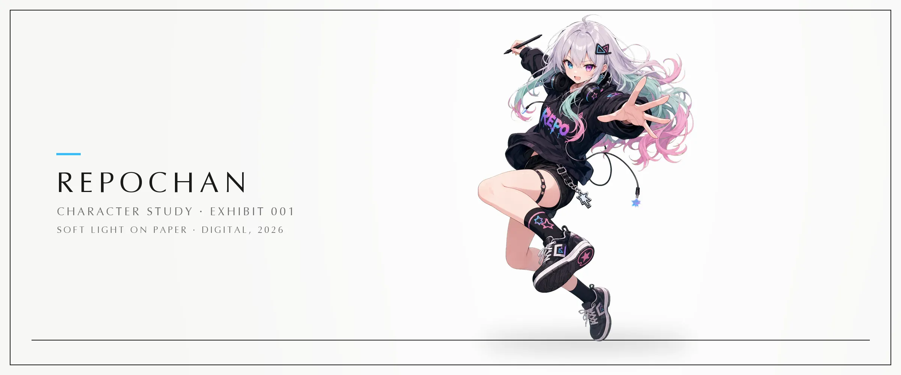
</picture>

</div>

# RepoChan

**Turn any git repository into a girl!** —

character sheets, icons, stickers, posters, and a landing page — driven by *your* coding agent.

<p align="center">

</p>

<p align="center">
<a href="https://www.npmjs.com/package/repochan"></a>
<a href="../../../LICENSE"></a>
<a href="https://nodejs.org">= 20"></a>
<a href="../../../packages/skill/"></a>
</p>

<p align="center"><b><a href="./README.md">English</a> · <a href="./README_zh.md">中文文档</a> · <a href="../../../ARCHITECTURE.md">Architecture</a></b></p>

---

You already use a coding agent (Claude Code, Codex, Pi, Cursor, Hermes, …). RepoChan gives that agent a creative pipeline to run: **analysis → persona → art direction → painting → landing page**. Hard rules live in code (schemas, state machine, dependency gates); creative judgment lives in skills. There is **no embedded runtime** — your agent orchestrates, RepoChan tracks.

## Try it

**Prerequisites:** Node.js ≥ 20, a coding agent you already use, and (for image generation) an OpenAI-compatible images endpoint.

```bash
npm install -g repochan && repochan setup          # installs skills into your agent
# repochan starter sync        # downloads the starter catalog on demand (~/.repochan/starters)
# repochan image configure       # image endpoint credentials configuration
```

Then open your coding agent in the project and input `/repochan` to run the RepoChan workflow. Try:

> "Give this repo a mascot and full brand assets"  
> "yolo, full pipeline"  
> "Only analyze this repository"

Run `repochan setup` again after upgrading the CLI so the bundled skills are refreshed; `repochan status` reports version drift when a refresh is needed.

<details>
<summary><b>Build from source (contributors)</b></summary>

```bash
pnpm install
pnpm -r build                 # builds core, image-gen, image-edit, cli
pnpm --filter repochan exec node dist/index.js setup
pnpm test                     # full monorepo test suite
```

See [`ARCHITECTURE.md`](./ARCHITECTURE.md) for the package layout, dependency direction, and release contract.

</details>

---

## How it works

You talk to **your agent**. The wizard skill schedules the teams:

<picture>
  <source media="(prefers-color-scheme: dark)" srcset="docs/readme-variants/pipeline-comic/assets/hero-comic-dark.webp">
  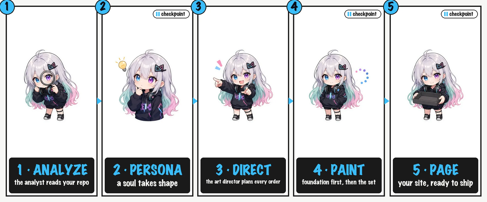
</picture>

| Mode | When | Behavior |
|------|------|----------|
| **Wizard (default)** | "Make me a mascot and site" | Full pipeline, stop at checkpoints |
| **yolo** | You explicitly say `yolo` | Default creative decisions inside the authorized scope; external writes still require explicit authorization |
| **Non-interactive** | CI / no TTY | Auto-select local reversible decisions; stop before unauthorized external writes |
| **Per-team (advanced)** | "Only run analysis" / "redraw this order" | Single team skill |

**Visual consistency** is anchored by a **foundation sheet** (character design cover). Downstream assets reference it, so the brand stays coherent from icon to landing page. Every role produces a schema-validated, versioned artifact under `.repochan/` — you can `cat`, `diff`, and `git blame` the whole creative state.

---

## Gallery

*The permanent collection. Every exhibit is a real artifact produced by this pipeline for RepoChan itself — persona, foundation, grids, cutouts, landings. No mockups.*

<table>
  <tr>
    <td align="center" width="33%">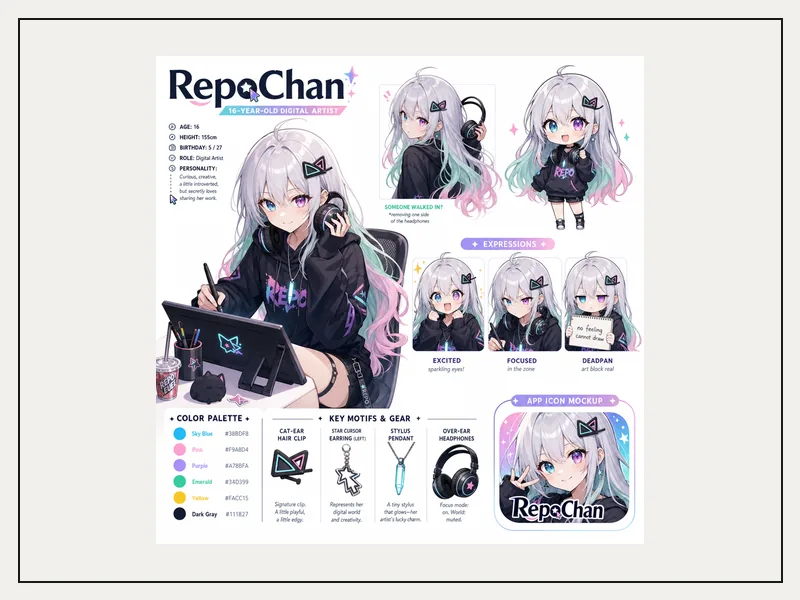<br/><sub>No. 001 — foundation sheet<br/><code>ord-foundation-001</code></sub></td>
    <td align="center" width="33%">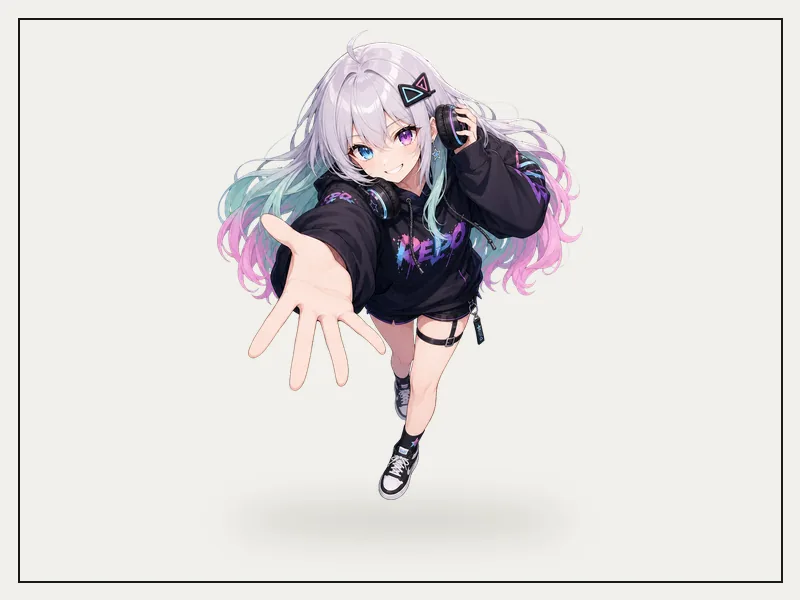<br/><sub>No. 002 — character cutout<br/><code>ord-cutout-001</code></sub></td>
    <td align="center" width="33%">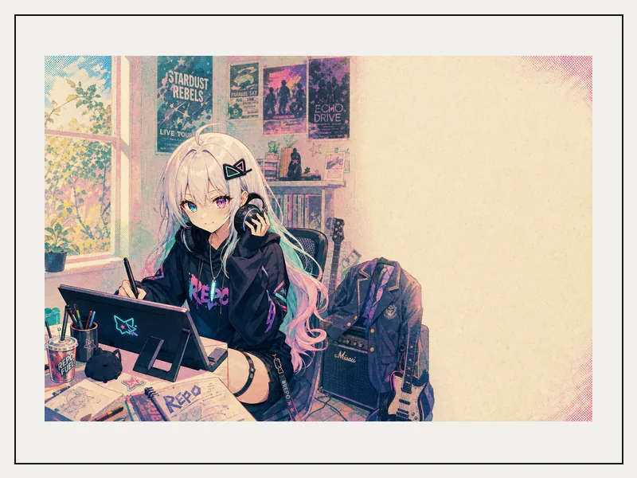<br/><sub>No. 003 — studio poster<br/><code>ord-poster-001</code></sub></td>
  </tr>
  <tr>
    <td align="center" width="33%">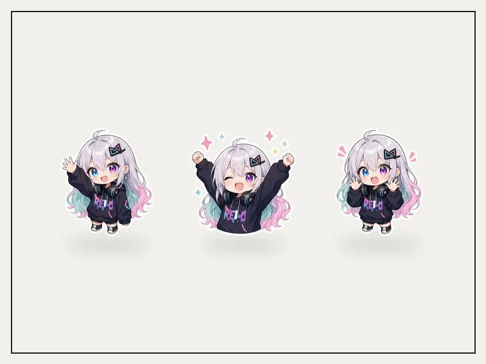<br/><sub>No. 004 — sticker specimens<br/><code>ord-sticker-001</code></sub></td>
    <td align="center" width="33%">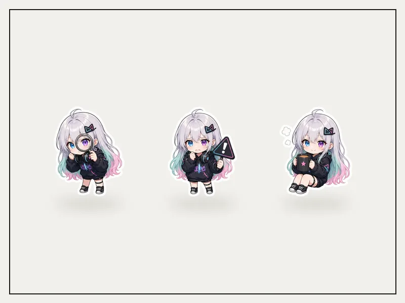<br/><sub>No. 005 — webstate specimens<br/><code>ord-webstates-001</code></sub></td>
    <td align="center" width="33%"><a href="../../../packages/starters/landing-museum">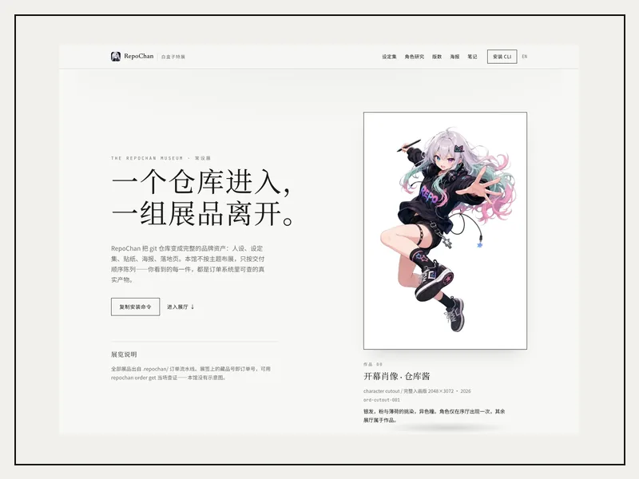</a><br/><sub>No. 006 — museum landing<br/><code>packages/starters/landing-museum</code></sub></td>
  </tr>
</table>

Grid sheets are generated on a uniform matte with a layout-guide reference, then cut by our own chroma-grid pipeline (soft-alpha unmix, centroid assignment, fail-loud QA) — the same `repochan image edit` commands ship in the CLI.

---

## Starter gallery

*Four of the twenty rooms. Complete, localizable Astro sites — each with slots, locale files, and order-backed assets. `repochan starter pull` any of them:*

<table>
  <tr>
    <td align="center" width="25%"><a href="../../../packages/starters/landing-neobrutal-zine">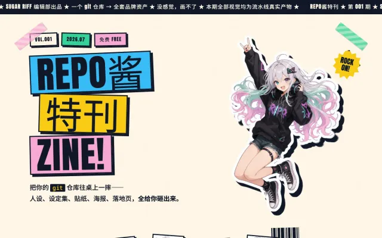<br/><sub>neobrutal-zine</sub></a></td>
    <td align="center" width="25%"><a href="../../../packages/starters/landing-frutiger-aero">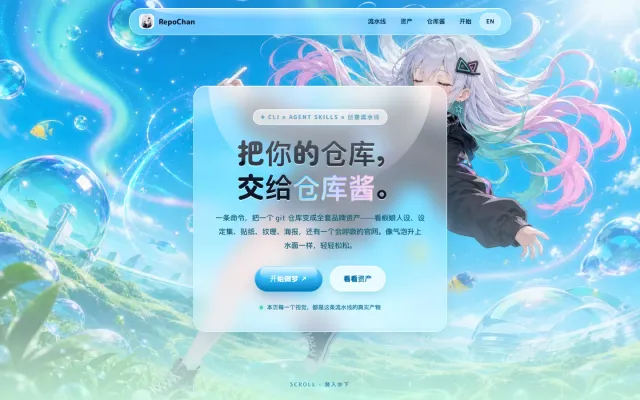<br/><sub>frutiger-aero</sub></a></td>
    <td align="center" width="25%"><a href="../../../packages/starters/landing-solarpunk">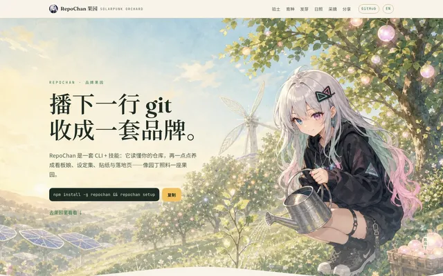<br/><sub>solarpunk</sub></a></td>
    <td align="center" width="25%"><a href="../../../packages/starters/landing-memphis">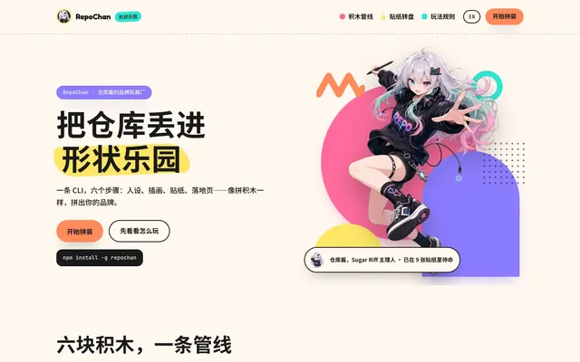<br/><sub>memphis</sub></a></td>
  </tr>
</table>

…plus 16 more — see the [starter catalog](./packages/starters/README.md).

---

## Go deeper

| Doc | Contents |
|-----|----------|
| [`ARCHITECTURE.md`](./ARCHITECTURE.md) | Layers, packages, binding model, design principles, known gaps |
| [`docs/releasing.md`](docs/releasing.md) | Leaf-first release contract |
| [`packages/skill/`](./packages/skill/) | Skill inventory (wizard + team roles) |
| [`packages/core/`](./packages/core/) | Protocol, schemas, business rules |
| [`packages/starters/`](./packages/starters/) | Landing-page starter catalog |

---

## Acknowledgments

RepoChan's cutout / grid-extraction pipeline (`@repochan/image-edit`) borrows proven techniques from these open-source projects:

- [`aldegad/sprite-gen`](https://github.com/aldegad/sprite-gen) (Apache-2.0) — the chroma v2 pipeline is a TypeScript port of its known-key soft-alpha unmix, trapped-spill despill, and key-depth classification; the centroid grid geometry (component assignment, merged-span split, debris handling) follows its slice-sheet design. See [`packages/image-edit/NOTICE`](./packages/image-edit/NOTICE).
- [`0x0funky/agent-sprite-forge`](https://github.com/0x0funky/agent-sprite-forge) — generation-side stabilization ideas: layout-guide images as composition references and fail-loud QC gates that feed regeneration instead of masking defects.

---

<div align="center">
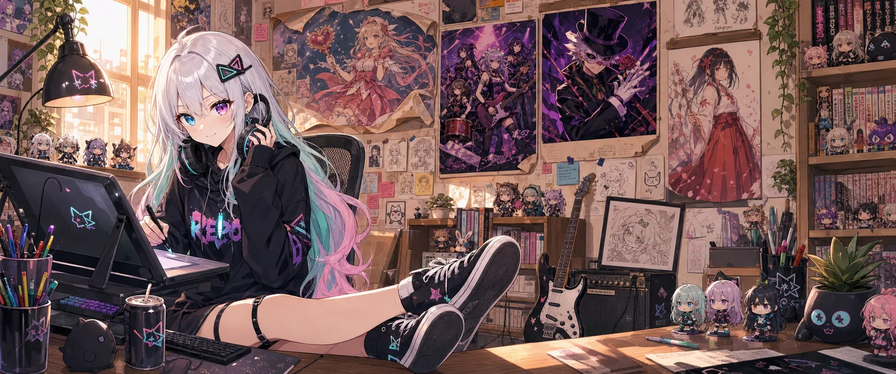
<br/>
<sub>Sugar Riff studio — every poster and figurine is a real piece of her world (and yes, the cola is always iced).</sub>
</div>
