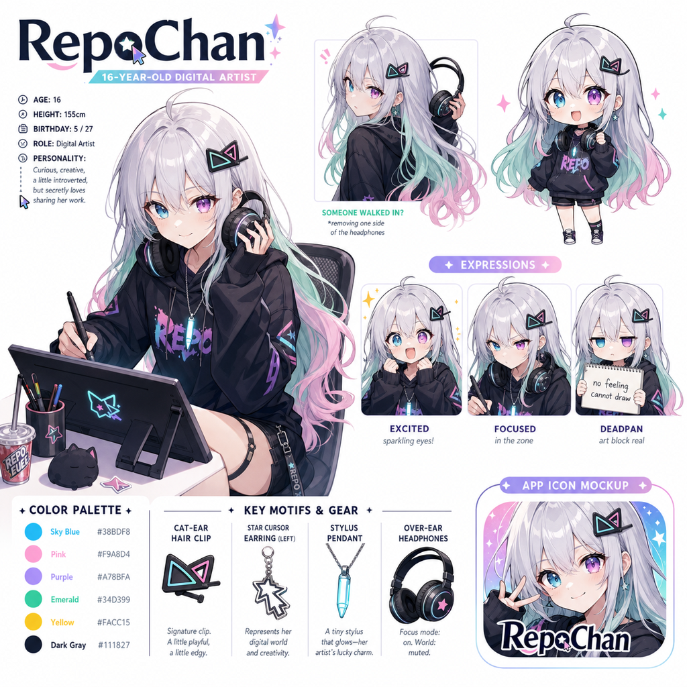
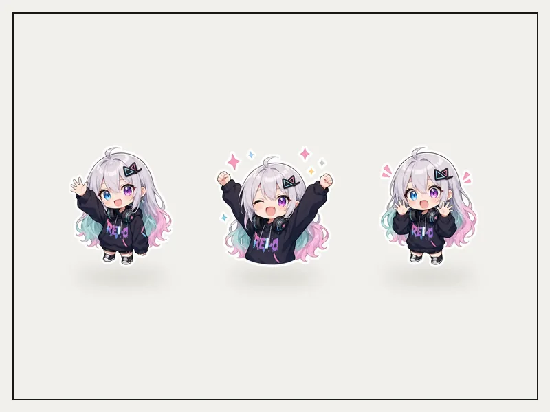
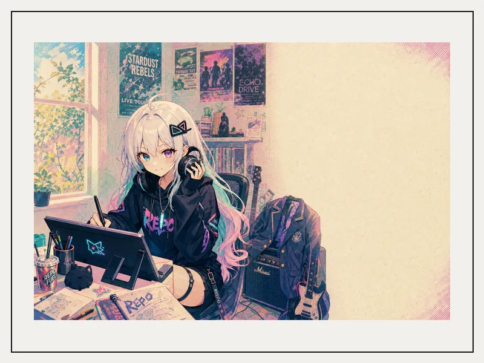
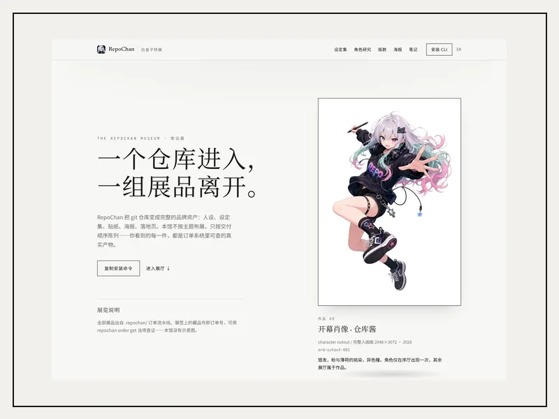

# RepoChan

**Give your Git repository an anime mascot and matching brand assets, using your own coding agent.**

**English** · [中文](./README_zh.md) · [Website](https://repochan.com)

<p align="center">
  <a href="./docs/assets/readme/foundation.png"></a>
</p>

This is the character sheet RepoChan generated for itself. Your project starts with a sheet like this: a mascot shaped by your repository and your preferences. It becomes the visual reference for matching icons, stickers, posters, and a project website.

## Get started

You need **Node.js ≥ 20** and a coding agent such as Claude Code, Codex, Pi, or Cursor.

```bash
npm install -g repochan
cd /path/to/your/project
repochan setup --project
```

Follow the prompts to select your agent and configure image generation. If you skip image setup, run `repochan image configure` before generating images.

Then open your coding agent in the project and send:

> Use the RepoChan skill to design a mascot for this repository. Generate the character sheet first, then wait for my feedback before making matching assets and a website.

Your agent will read the project and confirm the character concept with you before drawing the sheet. You can refine the character and its appearance before continuing.

## What you can make next

These are real outputs created for RepoChan, all based on the same character.

<table>
  <tr>
    <td align="center" width="50%"><br><b>Avatars and icons</b></td>
    <td align="center" width="50%"><br><b>Stickers</b></td>
  </tr>
  <tr>
    <td align="center" width="50%"><br><b>Posters</b></td>
    <td align="center" width="50%"><a href="./packages/starters/landing-museum"></a><br><b>Project websites</b></td>
  </tr>
</table>

## How it works

Read the repository → design the character → draw the character sheet → create matching assets → build the website.

RepoChan gives your existing coding agent the skills and CLI tools to do this. Character designs, images, and version history are saved in your project's `.repochan/` directory, so you can return to the work later.

## More

- [CLI usage and image configuration](./packages/cli/README.md)
- [Website templates](./packages/starters/README.md)
- [Skills and individual stages](./packages/skill/README.md)
- [Architecture](./ARCHITECTURE.md) · [Release guide](./docs/releasing.md)

## License and credits

[MIT](./LICENSE). The image-processing pipeline builds on techniques from [sprite-gen](https://github.com/aldegad/sprite-gen) and [agent-sprite-forge](https://github.com/0x0funky/agent-sprite-forge). See the [third-party notices](./packages/image-edit/NOTICE).
