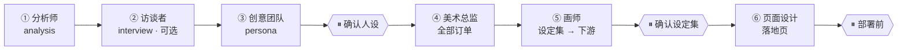

<div align="center">


<br/>

**把任何 git 仓库变成有生命力的吉祥物人设和统一的视觉品牌** ——

角色设定集、图标、贴纸、海报、落地页——由*你自己的* coding agent 驱动。

<br/>

[](https://www.npmjs.com/package/repochan)
[](./LICENSE)
[](https://nodejs.org)
[](./packages/skill/)

**[English](./README.md) · [中文文档](./README_zh.md) · [架构](./ARCHITECTURE.md)**

</div>

---

你已经在用某个 coding agent（Claude Code、Codex、Pi、Cursor、Hermes……）。RepoChan 交给它一条创意产线：**分析 → 人设 → 美术指导 → 绘制 → 落地页**。硬规则在代码里（schema、状态机、依赖门禁），创意判断在 skill 里。**没有内嵌运行时**——你的 agent 负责编排，RepoChan 负责记账。

## 它是怎么工作的

你跟**你的 agent**对话，向导 skill 负责调度团队：



| 模式 | 何时 | 行为 |
|------|------|------|
| **向导（默认）** | 「给我做吉祥物和网站」 | 全流程，检查点停下确认 |
| **yolo** | 你明确说 `yolo` | 授权范围内用默认创意决策；外部写仍需明确授权 |
| **非交互** | CI / 无 TTY | 自动选本地可逆决策；未授权的外部写之前停 |
| **单团队（高级）** | 「只做分析」「重画这张单」 | 单个团队 skill |

**视觉一致性**由**设定集（foundation sheet）**锚定：下游资产全部引用它，从 icon 到落地页保持同一角色。每个角色产出的是 `.repochan/` 下 schema 校验过的版本化产物——整个创意状态都能 `cat`、`diff`、`git blame`。

---

## 狗粮：我们自己的品牌就是 RepoChan 做的

下面的一切都是这条产线为 RepoChan 自己生产的——人设、设定集、网格、抠图、落地 starter。

<table>
  <tr>
    <td align="center"><br/><sub>欢迎</sub></td>
    <td align="center"><br/><sub>搜索中</sub></td>
    <td align="center"><br/><sub>成功</sub></td>
    <td align="center"><br/><sub>错误</sub></td>
    <td align="center"><br/><sub>惬意</sub></td>
    <td align="center"><br/><sub>抠图</sub></td>
  </tr>
</table>

网格图在统一 matte 上以 layout-guide 为构图参考生成，再由我们自己的 chroma-grid 管线切分（soft-alpha unmix、质心归格、fail-loud QA）——同样的 `repochan image edit` 命令就随 CLI 发布。

### Starter 画廊

完整可本地化的 Astro 站点——slot、locale 文件、订单溯源资产齐备。任意 `repochan starter pull`：

<table>
  <tr>
    <td align="center"><a href="./packages/starters/landing-swiss-type"><br/><sub>swiss-type</sub></a></td>
    <td align="center"><a href="./packages/starters/landing-memphis"><br/><sub>memphis</sub></a></td>
    <td align="center"><a href="./packages/starters/landing-glitch-os"><br/><sub>glitch-os</sub></a></td>
  </tr>
  <tr>
    <td align="center"><a href="./packages/starters/landing-solarpunk"><br/><sub>solarpunk</sub></a></td>
    <td align="center"><a href="./packages/starters/landing-museum"><br/><sub>museum</sub></a></td>
    <td align="center"><a href="./packages/starters/landing-toy-city"><br/><sub>toy-city</sub></a></td>
  </tr>
</table>

……另有 14 个，见 [starter 目录](./packages/starters/README.md)。

---

## 试试看

**前置要求**：Node.js ≥ 20、一个你已在用的 coding agent、（生成图像需要）一个 OpenAI 兼容的 images endpoint。

```bash
npm install -g repochan && repochan setup          # 把 skill 装进你的 agent
# repochan image configure       # 配置图像端点凭证
```

然后在项目里打开你的 coding agent，输入 `/repochan` 运行 RepoChan 工作流。试试：

> 「给这个仓库一个吉祥物和全套品牌资产」  
> 「yolo，全流程」  
> 「只分析这个仓库」

升级 CLI 后再跑一次 `repochan setup` 刷新随包 skill；`repochan status` 会在需要刷新时提示版本漂移。

<details>
<summary><b>从源码构建（贡献者）</b></summary>

```bash
pnpm install
pnpm -r build                 # 构建 core、image-gen、image-edit、cli
pnpm --filter repochan exec node dist/index.js setup
pnpm test                     # 全量 monorepo 测试
```

包结构、依赖方向、发布合同见 [`ARCHITECTURE.md`](./ARCHITECTURE.md)。

</details>

---

## 深入了解

| 文档 | 内容 |
|------|------|
| [`ARCHITECTURE.md`](./ARCHITECTURE.md) | 分层、包、绑定模型、设计原则、已知缺口 |
| [`docs/releasing.md`](./docs/releasing.md) | 叶子优先的发布合同 |
| [`packages/skill/`](./packages/skill/) | skill 清单（向导 + 团队角色） |
| [`packages/core/`](./packages/core/) | 协议、schema、业务规则 |
| [`packages/starters/`](./packages/starters/) | 落地页 starter 目录 |

---

## 致谢

RepoChan 的抠图 / 网格切分管线（`@repochan/image-edit`）借鉴了以下开源项目的成熟技术：

- [`aldegad/sprite-gen`](https://github.com/aldegad/sprite-gen)（Apache-2.0）—— chroma v2 管线移植自其已知背景色 soft-alpha unmix、trapped-spill despill 与 key-depth 分类；centroid 网格几何（连通域归格、跨格劈分、碎屑处理）沿袭其 slice-sheet 设计。见 [`packages/image-edit/NOTICE`](./packages/image-edit/NOTICE)。
- [`0x0funky/agent-sprite-forge`](https://github.com/0x0funky/agent-sprite-forge) —— 生成侧稳定化思路：以 layout-guide 图作为构图参考、fail-loud 质检门驱动重生而非掩盖缺陷。
