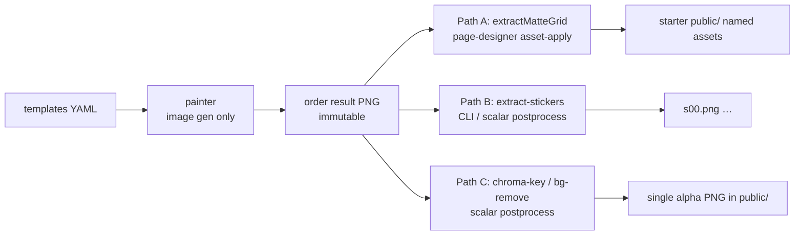
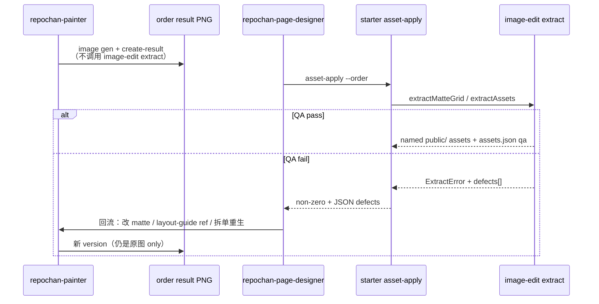
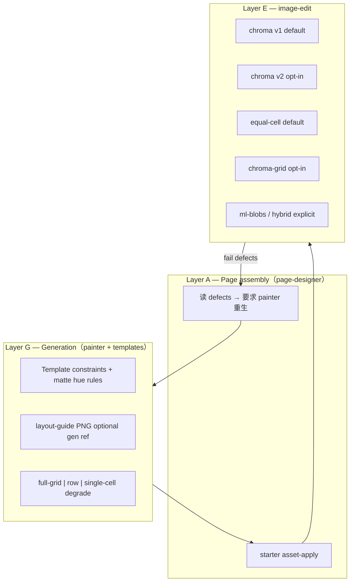
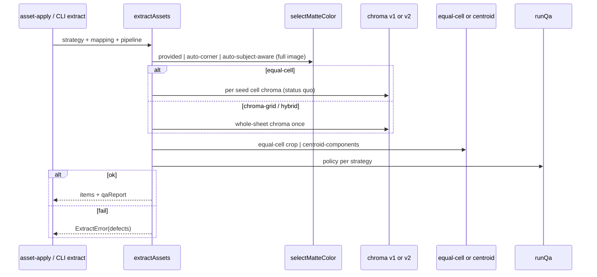
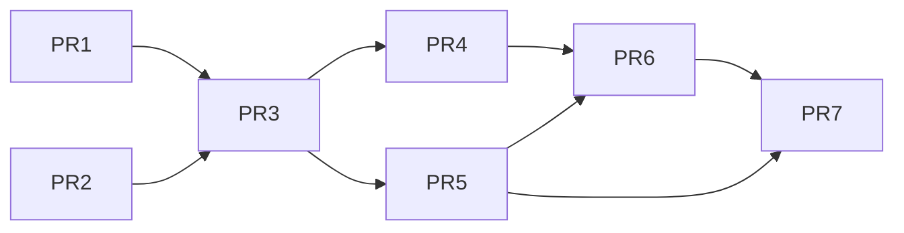

# RepoChan 抠图-切分稳定性改造设计稿

| 字段 | 值 |
|------|-----|
| **Title** | RepoChan Cutout / Slice Stability Redesign |
| **Author** | TBD |
| **Date** | 2026-07-20 |
| **Status** | Implemented（rev 5 — PR1–PR7 全部落地；rev 5 附记见文末） |
| **Scope** | stickers / cutouts / icon grids / web_state stickers（**不含** animation/GIF 生产路径） |
| **Packages** | `@repochan/image-edit` · `packages/cli` · `packages/templates` · `packages/skill` · `@repochan/core`（`validateExtractGridArgs` 扩展） |

---

## Overview

RepoChan 当前网格/抠图生产链路依赖「prompt 约束 uniform matte + 等分格子 / 或整图 ISNet + blob 计数」两条互不统一的路径。生产中的主要不稳定源是：AI 网格漂移、matte 污染、主体贴边、跨 cell 溢出、matte 色与主体色碰撞、硬 chroma 咬色、以及 `extractMatteGrid`（slot-based）与 `extractStickersFromImage`（blob-count-based）语义分裂。

本设计提出**多层稳定性架构**，严格遵守 monorepo 包边界与 **AGENTS.md 产品不变量 #5**：

> **`image-edit` 是 page-assembly 依赖，绝不是 Painter 依赖。** 派生抠图/切分产物只进入组装站点的 `public/`，经 `repochan starter asset-apply`（page-designer）完成；**永不**回写 order-result / `.repochan/` 协议产物。

1. **生成侧（templates + painter skill）**：matte 色相规则、可选 layout-guide 作 `image gen --reference`、高价值订单可选 row/single-cell 拆单。Painter **只**负责原图交付；**不**调用 extract。
2. **提取侧（`@repochan/image-edit` + CLI 绑定）**：soft-alpha unmix（v2 opt-in）、subject-aware matte、centroid grid（opt-in）、hybrid ML fallback（显式、默关）。
3. **组装侧（page-designer / `starter asset-apply`）**：唯一生产 extract 入口；结构化 defect 回流给向导/painter 做**重生**决策。
4. **迁移**：默认保持今日行为（equal-cell + chroma v1）直到 canary 与 golden 通过后由 PR7 切换。
5. **非目标**：animation strip / GIF 生产路径 / video2dsprite。

---

## Background & Motivation

### 当前生产路径（as-is）



| 路径 | 代码入口 | 策略 | 生产用途 | 调用方 |
|------|----------|------|----------|--------|
| **A** | `extractMatteGrid` | 等分 cell → `extractChromaKey` → alpha QA → trim → normalize | starter bundle `extract-grid` | **仅** `stageGridBundle`（`starter.ts`）via page-designer `asset-apply` |
| **B** | `extractStickersFromImage` | 整图 ISNet → CC → blob 数 = rows×cols | CLI `extract-stickers`；scalar postprocess | 调试 / 少数 scalar 管线 |
| **C** | `chromaKeyImage` / `removeImageBackground` | 单图 chroma 或 ISNet | cutout scalar | starter postprocess（neobrutal / scrollytelling / character-game-page 等） |

**Chroma 现状（v1，`chroma-key.ts`）**：

| 常量 | 值 | 含义 |
|------|-----|------|
| `DEFAULT_THRESHOLD` | **28.0** | Euclidean 距离下界：≤ 完全透明 |
| `DEFAULT_SOFTNESS` | **34.0** | 软边带宽；alpha = smoothstep((d−low)/(high−low)) |
| `DEFAULT_SPILL_SUPPRESSION` | **0.85** | 高对比 matte 边缘 despill |
| `estimateMatteColor` | 四角 32×32 分箱 mode | **不**检查与主体色冲突 |

另有 unpremultiply 去污染 + `suppressMatteSpill`。无 soft-alpha blend 求解、无 trapped-spill、无 ycbcr。

**CLI 面**：`image edit slice | validate-seams | bg-remove | chroma-key | extract-stickers | resize | favicon | compress | gif-from-frames`。**无**通用 matte-grid CLI；生产 grid 只走 `starter asset-apply`。

**Starter 配置**（例 neobrutal-zine）：

```json
{ "op": "extract-grid", "args": {
  "rows": 3, "cols": 3,
  "chroma": { "matteColor": "auto" },
  "normalize": { "canvasSize": 256, "padding": 16 },
  "format": "webp"
}}
```

`assets.json` 写入（`starter.ts` ~477）：

```ts
qa: { ...item.qa, geometry: item.geometry }
// geometry.foreground 今日相对 equal-size source cell
```

### 痛点

1. **等分 cell 假设脆弱**（RC1/RC2）  
2. **blob 硬计数脆弱**（RC2/RC6）  
3. **matte auto 只看四角**（RC4）  
4. **双路径语义分裂**（RC8）  
5. **硬失败信息不足**（RC9）— `printError` 只打 `message` 字符串  
6. **生成侧仅靠文字 grid**（RC7）  

### 与架构契约的关系

| 约束 | 本设计的遵守方式 |
|------|------------------|
| AGENTS #5 image-edit ≠ Painter | extract / asset-apply / 结构化 QA 属 **page-designer**；painter 只 gen + 按回流缺陷改 prompt |
| image-edit 零凭证、无协议 | 维持；ML 网络能力显式标注 |
| CLI 原子、无 `repochan run` | extract 不自动重生；编排在 skill |
| order-result 不可变 | 派生文件只写 starter `public/` |
| overwrite 门闩 | 维持 |

---

## Goals & Non-Goals

### Goals

1. **稳定提取（可量化）**：
   - **门禁 A**：合成 fixture 套件（见 Testing）**100% 绿** 才允许 PR merge。
   - **门禁 B（PR7 前）**：真实失败样例集（若有）通过率 ≥ **80%**，且 canary starter 端到端无回归。
   - 合成套件至少覆盖：干净 3×3、邻格溢出、粘连双主体、matte 撞色条带、soft fringe、empty cell、edge sheet。
2. **统一库内 API**：`extractAssets` 策略枚举；**对外兼容** 旧函数与 `extract-stickers` JSON。
3. **Fail loud + 结构化 defect**：CLI/`asset-apply` 在 `--json` 失败时输出可解析 `defects[]`；**重生决策**在 page-designer 向导链 → painter（**不**由 painter 跑 extract）。
4. **包边界不破**；`core.validateExtractGridArgs` 扩展已知键校验。
5. **向后兼容直至 PR7**：默认 `strategy=equal-cell`、scalar `chroma-key` 默认 **pipeline v1**；新能力 opt-in。

### Non-Goals

| 非目标 | 说明 |
|--------|------|
| Animation / component-row | 本期不做 |
| GIF 生产改造 | 不动 |
| video2dsprite | 预留 Open Question |
| Curation webview | 不做 |
| 内嵌 agent runtime | 禁止 |
| 改 image-gen 凭证 | 不做 |
| 修改官方 starter 源艺术 | 仅 postprocess args / skill 文档 |
| Pixel-perfect palette | 不做 |
| **修改 AGENTS #5** | **不**为让 painter 跑 extract 而改不变量 |

---

## Ownership & Role Contract（修订重点）



| 角色 | 拥有 | 禁止 |
|------|------|------|
| **Painter** | `image gen`、foundation 引用、layout-guide 作 **gen reference**、按缺陷改 prompt/matte/拆单 | 对 order 产物跑 `image edit extract*` 作为交付预检；手写 `.repochan/`；把派生 alpha 写回 order |
| **Page-designer** | `starter create-order`、`asset-apply`、解读 extract defects、决定是否要求 painter 重生 | 手切 PNG 绕过 asset-apply；半完成 assets.json |
| **Web-designer** | 原创站点时可直接用 `image edit` CLI（AGENTS 已允许） | 把派生文件写进协议 order-result |
| **image-edit / CLI extract** | 确定性像素 + QA metrics | 调 image-gen；协议写 |

**例外说明（不破坏 #5）**：

- **Layout guide**：确定性几何 PNG（`writeLayoutGuide`），painter 仅将其作为 `image gen --reference` 的构图约束，**不是**对 order 做 extract。
- **调试**：page-designer 文档已写「只有调试 image-edit 本身时才直接调用 `repochan image edit`」——保持；**不**写入 painter checklist。
- **Scalar cutout Path C**：仍由 **asset-apply 的 postprocess**（`chroma-key` / `bg-remove`）执行，不是 painter 步骤。

---

## Prior Art Analysis

研究路径：`/tmp/repochan-research/agent-sprite-forge/`、`/tmp/repochan-research/sprite-gen/`。

### 系统定位对照

| 维度 | **agent-sprite-forge** | **sprite-gen** | **RepoChan（现状）** |
|------|------------------------|----------------|----------------------|
| 产品目标 | 游戏 2D sprite / map | component-row 精灵 + 变体 sheet | Web：贴纸、cutout、icon、web state |
| Agent 角色 | Codex skill 拥有 plan | Skill + `sprite-request.json` | Painter gen；page-designer assemble；CLI 原子 |
| Matte | 默认 `#FF00FF` | **auto 远离主体 hue** | 模板文字 + 四角 mode |
| 布局 | layout / anchor guide 图 | draw_guide | 纯 prompt |
| 提取几何 | 帧切 + CC 过滤 | **CC centroid / slice-sheet** | A 等分；B 全局 CC 硬计数 |
| Alpha | magenta cleanup | hard + soft-unmix + spill；opt ycbcr | RGB smoothstep 28/34 |
| QC / 失败 | strict → regen | fail loud；inspect→score | 字符串 throw |
| 与 RepoChan 同构 | 高（skill+gen+local） | 中（游戏向） | — |

### 采纳 / 拒绝矩阵

| 能力 | 来源 | 决策 | 理由 |
|------|------|------|------|
| Soft-alpha unmix + trapped spill | sprite-gen | **Adopt（v2 opt-in）** | 咬色/锯齿；参数移植见附录 A |
| Matte auto away from subject | sprite-gen | **Adopt** | 看板娘色相多样 |
| Centroid + debris | sprite-gen slice-sheet | **Adopt（opt-in→PR7）** | 修漂移/溢出 |
| Layout guide image ref | forge | **Adopt** | 文本 grid 不够 |
| Fixed #FF00FF only | forge | **Reject as default** | 粉/紫冲突 |
| Per-action always | forge | **Reject default** | 成本；仅重生降级 |
| Component-row animation | sprite-gen | **Reject 本期** | 非范围 |
| Curation webview | sprite-gen | **Reject** | 无 UI |
| ycbcr | sprite-gen | **Defer stub** | flat matte 足够 |
| Python sidecar | — | **Reject** | 包边界 |
| Painter 跑 extract 预检 | 原 rev1 误设 | **Reject** | AGENTS #5 |

### Alt F（补充）：仅 equal-cell + soft-unmix、无 centroid

| | Alt F | 完整 chroma-grid |
|--|-------|------------------|
| 修 RC5 咬色/锯齿 | ✓ | ✓ |
| 修 RC1 网格漂移 | ✗ 仍等分裁切 | ✓ |
| 修 RC2 邻格溢出 | ✗ | ✓ |
| 实现量 | 较小 | 中 |

**结论**：Alt F 可作为 PR1 单独落地的中间态（scalar/cutout 立即受益），但 **不能**关闭 RC1/RC2；centroid 仍是 grid 生产 P0。

---

## Root Cause Taxonomy

| ID | 根因 | 主责层 | 现码 |
|----|------|--------|------|
| RC1 | Grid geometry drift | Gen + Extract | `computeTileCells` |
| RC2 | Overflow / merge | Gen + Extract | edge QA；blob count |
| RC3 | Matte pollution | Gen | chroma 残留 |
| RC4 | Matte–subject collision | Gen + Extract | corner-only auto |
| RC5 | Hard chroma fringe | Extract | smoothstep only |
| RC6 | ML matte pollution | Extract B | ISNet 整图 |
| RC7 | Identity/scale drift | Gen | 无 guide |
| RC8 | Dual-API confusion | Surface | A vs B |
| RC9 | Opaque failure | CLI | `printError` message only |
| RC10 | Normalize masking | Extract | 总是 fit inside |

P0：RC1/RC2/RC4/RC5。P1：RC3/RC7/RC8/RC9。P2：RC6/RC10。

---

## Proposed Design

### 多层架构（修订 ownership）



### 统一提取管线



---

## Algorithm Specifications

### 1. 双轨 Chroma：v1（默认）与 v2（opt-in soft-unmix）

**决策**：两套算法并存，**不是**把 v1 的 28/34 当作 sprite-gen unmix 的 hard-cut。

| | **v1（现状，默认）** | **v2（sprite-gen 对齐，opt-in）** |
|--|----------------------|-----------------------------------|
| 入口 | `extractChromaKey` / `chromaKeyImage` 默认 | `runChromaPipeline` / `pipeline: "v2"` |
| 模型 | Euclidean + smoothstep 软 alpha | hard cut + soft-alpha unmix + trapped spill |
| 默认 hard 半径 | threshold=**28**, softness=**34** | threshold=**96**, fringeThreshold=**180**, fringeDelta=**18** |
| 适用 | 已发 starter cutout 像素稳定 | 新 extract-grid canary、显式 flag |
| Scalar `chroma-key` CLI | **保持 v1 默认** | 需 `--pipeline v2` |
| extract-grid | 默认 v1；canary 可 `chroma.pipeline: "v2"` | PR7 可改默认 |

#### 1.1 v1 行为契约（冻结）

保持 `chroma-key.ts` 现行为：distance → smoothstep alpha → unpremultiply → `suppressMatteSpill`。  
**禁止**在未显式 `pipeline: "v2"` 时改变默认阈值（避免 neobrutal/scrollytelling 等 cutout 像素漂移）。

#### 1.2 v2 规范公式（可实现）

移植自 sprite-gen `sprite_gen/extract.py`（**Apache-2.0**，实现时在 `NOTICE`/`chroma-pipeline.ts` 头注释保留归因；允许行为对齐的 TS 重写，**不得**凭空改常数）。

**`key_tint_score(color, chroma_key) → float`**：

```
keyed_channels   = { i | chroma_key[i] >= 192 }
unkeyed_channels = { i | chroma_key[i] <  64 }
if either set empty: return 0
return avg(color[keyed]) - avg(color[unkeyed])
```

对纯洋红 key (255,0,255)：score ≈ `(R+B)/2 - G`。对纯绿 (0,255,0)：`G - max(R,B)` 类推。  
`key_tint = key_tint_score(key, key)`（键自身分数，作归一化分母）。

**`despill_color` / unmix**（blend：`observed = (1−k)·subject + k·key`）：

```
k = min(tint / key_tint, 1)   // tint = key_tint_score(color, key)
coverage = 1 - k
if coverage <= 0: return alpha 0, rgb 0
subject_c = clamp((obs_c - k * key_c) / coverage)
out_alpha = round(src_alpha * coverage)
```

**像素分类（在 hard cut 之后）**：

| class | 条件 |
|-------|------|
| KEYED | `alpha==0` 或 `color_distance(rgb,key) <= threshold` → 写 (0,0,0,0)，depth=0 |
| SUBJECT | `key_tint_score < fringe_delta` → **永不 unmix** |
| BLEND_IN_BAND | tint ≥ fringe_delta 且 `distance <= fringe_threshold` |
| BLEND_OUT_OF_BAND | tint ≥ fringe_delta 且 distance > fringe_threshold |

**Chebyshev depth（8-connected）**：从全部 KEYED 像素 BFS，邻居为 3×3（含对角），`depths[n]=depth`，直到 `unmix_reach`。

**Soft-alpha unmix 应用**：

- 仅 `0 < depths[i] <= unmix_reach`
- OUT_OF_BAND：始终 unmix
- IN_BAND：仅 `depths[i] <= 2`（`_IN_BAND_UNMIX_KEY_DEPTH = 2`）——更深的 in-band 材质保持 byte-identical

**Trapped-spill despill**：

```
subject_count = count(class != KEYED)
spill_limit = max(32, round(subject_count * spill_max_fraction))
```

对仍 `tint >= fringe_delta` 的像素做连通簇；若 `size <= spill_limit` **且** 簇内 `max(tint) >= 40`（`_SPILL_MIN_TINT`）→ 就地 despill RGB，**保持 alpha**（防针孔）。大簇视为故意 key 色材质。

**v2 默认常数表（规范性）**：

| 常量 | 值 | 来源 |
|------|-----|------|
| `threshold` (hard cut) | **96** | sprite-gen `DEFAULT_KEY_THRESHOLD` |
| `fringeThreshold` | **180** | `DEFAULT_FRINGE_KEY_THRESHOLD` |
| `fringeDelta` | **18** | `DEFAULT_FRINGE_DELTA` |
| `unmixReach` | **4** | default unmix reach |
| `spillMaxFraction` | **0.005** | sprite-gen |
| `inBandUnmixKeyDepth` | **2** | sprite-gen |
| `spillMinTint` | **40** | sprite-gen `_SPILL_MIN_TINT` |
| depth connectivity | **8-connected** | sprite-gen 3×3 frontier |

**v2 与 v1 组合规则**：

- v2 **替换** v1 的 smoothstep/unpremultiply 链，**不是**串在后面。
- `softness` 在 v2 **忽略**（或 CLI 警告 unused）。
- `spillSuppression` 不驱动 v2；trapped-spill + unmix 取代 `suppressMatteSpill`。
- `pipeline: "v1" | "v2"`；缺省 **v1**。

```typescript
export type ChromaPipelineOptions = {
  pipeline?: "v1" | "v2"; // default "v1"
  matteColor?: MatteColor | "auto";
  // v1
  threshold?: number;      // v1 default 28; v2 default 96 if pipeline v2
  softness?: number;       // v1 only, default 34
  spillSuppression?: number; // v1 only
  // v2
  fringeThreshold?: number;  // default 180
  fringeDelta?: number;      // default 18
  unmixReach?: number;       // default 4
  spillMaxFraction?: number; // default 0.005
  mode?: "rgb" | "ycbcr";    // ycbcr: PR 内 stub → throw Unsupported
};

export function runChromaPipeline(
  data: Buffer, width: number, height: number, channels: number,
  options: ChromaPipelineOptions,
): ChromaPipelineResult;
```

**PR1 强制**：`pipeline: "v2"` **仅 opt-in**；附 golden 像素 fixture 后才考虑任何默认切换。

### 2. Matte 色自动选择

```typescript
export type MatteSelectResult = {
  matte: MatteColor;
  /** How the key was chosen. */
  source: "provided" | "auto-sampled" | "auto-subject-aware";
  /** Higher = safer distance from subject (subject-aware scoring). Corner mode may use 0. */
  score: number;
  /** Euclidean RGB distance from matte to nearest non-background subject sample. */
  minSubjectDistance: number;
  /** true iff minSubjectDistance >= eraseRadius used for hard-cut. */
  clearsEraseRadius: boolean;
  eraseRadius: number;
  candidateScores: Array<{
    matte: MatteColor;
    score: number;
    minSubjectDistance: number;
    clearsEraseRadius: boolean;
  }>;
  /** Non-fatal notes (e.g. corner-auto weak clearance). */
  warnings?: string[];
};

export function selectMatteColor(
  data: Buffer, width: number, height: number, channels: number,
  options?: {
    mode?: "corner" | "subject-aware"; // default "corner" for back-compat of "auto"
    candidates?: MatteColor[]; // default magenta, green, cyan
    eraseRadius?: number; // default = active pipeline hard threshold
    cornerSample?: number; // 32
  },
): MatteSelectResult;
```

- **`auto` 在 v1 默认路径**：保持今日 **corner mode**（`estimateMatteColor`），避免 silent 行为变化。
- **`auto` + `matteSelect: "subject-aware"`** 或 canary starter 显式开启：候选键对主体像素 `min_distance` 打分；拒绝 `min_subject_distance < eraseRadius`；全失败则取 max score + `clearsEraseRadius: false`。
- 生成侧 skill 色相表（写入 **page-designer 回流说明 + templates**，非 painter extract）：粉/紫→绿；绿→洋红；深红→绿。

#### Matte / residue 硬失败规则（规范性）

| Code | 何时 **硬失败**（emit `ExtractError`） | 何时仅 soft / 不发码 |
|------|----------------------------------------|----------------------|
| **`matte_subject_collision`** | (1) `matteSelect === "subject-aware"` 且最终 `!clearsEraseRadius`；**或** (2) **provided** matte（非 auto）且 `minSubjectDistance < eraseRadius`（`eraseRadius` = 当前 pipeline hard threshold：v1→28，v2→96） | 默认 **corner auto**：`clearsEraseRadius: false` 只写入 `qa.matte.warnings[]`，**不** hard-fail（保持今日行为） |
| **`chroma_residue`** | 见下方 **后 chroma 残留检测**（与 v1/v2 depth 语义一致，**禁止**使用 pipeline 内部 `depth==0`） | 小于阈值：只写 `qa.metrics.chromaResidueRatio` |

##### `chroma_residue` 算法（实现必须按此，勿用 pipeline depth==0）

**为何不能用 v2 的 `depth==0`：** Appendix A 中 `depth==0` **仅**赋给 KEYED 像素，且 KEYED 已被写成 `(0,0,0,0)`。opaque ∧ depth==0 **恒空**，码永不触发。

**规范检测（v1 与 v2 共用）——在 chroma 输出 RGBA 上重算，与 pipeline 内部 depth 无关：**

```
αT = qa.alphaThreshold          // default 16
fringeDelta = chroma.fringeDelta ?? 18   // v1 亦用 18 作 tint 地板
D = qa.residueEdgeDepthPx ?? 2  // Chebyshev 邻域：贴透明边的 key 色残留
residueMaxFraction = qa.residueMaxFraction ?? 0.001

// 1) 透明掩码 + 主体计数
transparent(p)  := alpha(p) < αT
opaque(p)       := alpha(p) >= αT
subjectPixels   := count(opaque)

// 2) 从所有 transparent 像素做 8-connected Chebyshev BFS，得到
//    distTransparent[p] = 到最近透明像素的距离（opaque 内部为更大值；
//    transparent 像素自身 dist=0，且不计入 residue）
//    上限扫描到 D 即可（更远不参与 residual-edge 判定）

// 3) 残留像素（「贴着本该是背景的透明区、却仍不透明的 key 色污渍」）
residue(p) := opaque(p)
           AND key_tint_score(rgb(p), matte) >= fringeDelta
           AND distTransparent[p] <= D

residuePixels := count(residue)
ratio := residuePixels / max(1, subjectPixels)

if ratio > residueMaxFraction → hard fail chroma_residue (metric=ratio)
else → qa.metrics.chromaResidueRatio = ratio
```

**意图与边界：**

| 情况 | 结果 |
|------|------|
| 平坦 matte 已抠净，主体边缘仅正常 unmix 半透明 | dist 到透明 ≤ D 但 tint 通常 &lt; fringeDelta → 不计 |
| 大块 matte 污渍留在「应透明」区却仍 opaque 高 tint | 贴透明边（或被透明包围的洞边）→ 计入 → 易超 0.001 |
| 主体内部故意的 key 色材质（如粉红衣服） | distTransparent 通常 **&gt; D**（深处）→ **不**计，避免方案 3 的假阳性 |
| v1 smoothstep 留下贴边 key 色 | 同样适用（输出后重算，不依赖 v2 depth 数组） |

**合成 fixture（PR3 必测）：** 纯 matte 底上主体旁留一块 **opaque 且颜色=matte** 的矩形污渍 → 必须 hard-fail `chroma_residue`。干净 3×3 → 不 fail。

```typescript
// ExtractAssetsOptions.qa additions
residueMaxFraction?: number;   // default 0.001
residueEdgeDepthPx?: number;   // default 2; Chebyshev dist to transparent
// fringeDelta for residue: chroma.fringeDelta ?? 18 (shared v1/v2)
```

Skill 表中这两码 **仅在上述 hard 条件满足时**出现；page-designer 重生表保持有效。

### 3. Grid strategies 与默认迁移

| strategy | 几何 | **Chroma 作用域**（不变量） | Matte 采样 | 默认？ |
|----------|------|------------------------------|------------|--------|
| **`equal-cell`** | `computeTileCells` 裁切 | **per seed cell** 跑 chroma（status quo：`copyCell` → `extractChromaKey` / v2 per cell） | **整图一次**（status quo） | **是（直至 PR7）** |
| **`chroma-grid`** | centroid CC + debris | **whole-sheet 一次** chroma，再几何 | 整图一次 | opt-in canary |
| **`ml-blobs`** | 今日 stickers | N/A（ISNet 整图） | N/A | 仅 extract-stickers |
| **`hybrid`** | 同 chroma-grid，失败可 ML | whole-sheet 先；见 §7 | 整图一次 | 显式；**要求** `mlFallback: true` |

**equal-cell 像素兼容不变量**：`extractAssets({ strategy: "equal-cell", chroma: { pipeline: "v1" } })` 在现有 matte-grid fixture 上须与当前 `extractMatteGrid` **像素一致**（或 α/RGB 全等）。禁止为「代码统一」把 equal-cell 改成 whole-sheet chroma——那会改变 cell 边界 soft-edge 与 QA metrics。

```typescript
// 兼容层 — 默认不得抢跑为 chroma-grid
export async function extractMatteGrid(...) {
  return extractAssets(imagePath, outDir, {
    strategy: options.strategy ?? "equal-cell",
    chroma: { pipeline: options.chroma?.pipeline ?? "v1", ... },
    ...
  });
}
```

#### `strategy` vs `geometry.mode` 优先级

| 规则 | 行为 |
|------|------|
| **`strategy` 为 SSoT** | 决定 chroma 作用域 + 默认几何 |
| 省略 `geometry.mode` | equal-cell → 隐含 `equal-cell`；chroma-grid / hybrid → 隐含 `centroid-components`；ml-blobs → 无 geometry |
| `strategy=chroma-grid\|hybrid` + `geometry.mode=centroid-components` | 合法（冗余可） |
| `strategy=chroma-grid\|hybrid` + `geometry.mode=equal-cell` | **非法** → `validateExtractGridArgs` / CLI 拒绝 |
| `strategy=equal-cell` + `geometry.mode=centroid-components` | **非法** |
| `strategy=ml-blobs` + 任意 `geometry` | **非法**（geometry 不适用） |
| `strategy=hybrid` + `hybrid.mlFallback !== true` | **非法**（见 §7） |

### 4. chroma-grid 几何（钉死常数）

对齐 `sprite_gen/slice_sheet.py`：

| 常量 | 值 | 说明 |
|------|-----|------|
| `MERGED_SPAN_FACTOR` | **1.5** | bbox 跨度 > 1.5×cell → 按像素切开 + in-cell relabel |
| `debrisFraction` | **0.30** | 相对 main 组件 |
| `debrisBorderTolPx` | **2** | 距 seed cell 边 &lt; 2px 视为贴边 |
| `noiseMinAbs` | **60** | 绝对像素下限 |
| `minBlobFraction` | **0.005** | 另：`max(noiseMinAbs, floor(W*H*fraction))` |
| CC alpha threshold | **16**（chroma 后） | 与 matte-grid QA 一致；**ml-blobs 保持 128** |
| CC connectivity | **4-connected**（复用 `findConnectedComponents`） | 与现 stickers 一致；depth BFS 仍 8-connected |

**流程**：

1. Whole-sheet chroma（v1 或 v2）一次。  
2. CC → 丢噪声。  
3. centroid → seed cell index（`computeTileCells` 定义 seed 矩形）。  
4. merged span → split + in-cell relabel。  
5. debris 丢弃；非贴边特效与 main **union bbox**。  
6. empty cell → `empty_cell`。  
7. normalize 到 canvas（web sticker 默认 center）。

**subset**：始终跑 **完整** grid 分配与 QA；仅 **publish** `subset` 键。避免半图 CC 语义不一致。

### 5. Edge QA 政策（按 strategy）

| Strategy | edge_touch 定义 | 默认 `maxEdgeTouchRatio` |
|----------|-----------------|---------------------------|
| **equal-cell** | 前景相对 **seed cell 画布** 周界（今日行为） | **0**（硬失败） |
| **chroma-grid** | (a) 相对 **隔离 crop 画布** 周界的 edge 仅作 soft metric 写入 report；(b) 硬失败：主体接触 **整张 sheet 外边界**（`sheetEdgeTouchPixels > 0` 或 ratio 超阈）；(c) empty after debris → hard | 硬门用 `maxSheetEdgeTouchRatio` 默认 **0**；seed-cell edge **不**再当 hard fail（否则 centroid 挽救的溢出仍被杀） |
| **ml-blobs** | 无 edge QA（今日）；可选后续 | — |

`foreground_ratio` 对 chroma-grid 在 **union crop** 上计算（非 seed cell 面积），阈值沿用 0.005–0.8 除非 canary 调参。

### 6. `MatteGridItem.geometry` 扩展（向后兼容）

```typescript
export type MatteGridItemGeometry = {
  /** Seed equal-cell rect in source image coords (always present). */
  cell: TileCell;
  /**
   * Foreground bbox.
   * equal-cell: relative to cell origin (LEGACY, unchanged).
   * chroma-grid: relative to cell origin may be negative / > cell size if overflow kept;
   *   consumers that assumed "inside cell" MUST read sourceBounds.
   */
  foreground: { x: number; y: number; w: number; h: number };
  /** Absolute bbox in full source image coordinates (NEW; equal-cell also filled). */
  sourceBounds: { x: number; y: number; w: number; h: number };
  /** Isolation crop canvas size before normalize (NEW). */
  cropSize: { w: number; h: number };
  normalized: {
    x: number; y: number; w: number; h: number;
    canvasWidth: number; canvasHeight: number; padding: number;
    align: "center" | "feet";
  };
};
```

- **equal-cell**：`sourceBounds = cell origin + foreground`；旧字段语义不变。  
- **chroma-grid**：`sourceBounds` 为真相；`foreground` 仍填「相对 seed cell」可负，便于 diff。  
- `assets.json` 已是 `qa?: Record<string, unknown>` → 新字段可进；文档注明消费者应优先 `sourceBounds`。

### 7. Hybrid ML fallback

```typescript
export type HybridPolicy = {
  /** Required true when strategy === "hybrid". Default false only meaningful as field default on chroma-grid. */
  mlFallback?: boolean;
  model?: "small" | "medium";
  /**
   * Geometry for ML assist after chroma-grid fail:
   * - "seed-cell": crop equal-cell (may reintroduce drift) — simple salvage
   * - "dilated-seed": seed cell expanded by marginPx (default 0.15 * cell) then ML
   * - "source-bounds": if partial chroma crop exists, ML that bbox
   * default: "dilated-seed"
   */
  mlCrop?: "seed-cell" | "dilated-seed" | "source-bounds";
  dilateFraction?: number; // default 0.15
};
```

**`hybrid` + `mlFallback` 语义（钉死）**：

| 调用 | 行为 |
|------|------|
| `strategy: "chroma-grid"` | 纯 chroma-grid；忽略 `hybrid.mlFallback`（或 warn if true without strategy hybrid） |
| `strategy: "hybrid", mlFallback: true` | chroma-grid → QA fail → ML assist → 再 QA；仍 fail → ExtractError |
| `strategy: "hybrid", mlFallback: false` / 缺省 | **非法** — 校验阶段拒绝：`hybrid requires hybrid.mlFallback === true; use strategy chroma-grid otherwise` |
| `strategy: "hybrid"` 省略 hybrid 对象 | 非法（同上） |

即：**不存在**「hybrid 且不需要 ML capability」的合法配置，避免与 chroma-grid 死枚举重复。

**离线边界**：

| API / 路径 | 网络 |
|------------|------|
| equal-cell / chroma-grid + chroma only | **无网络**（验收：单测禁网） |
| `repochan image edit ml install` | **显式联网安装** ML runtime 与随包提供的模型到 capability cache |
| `ml-blobs` / `removeImageBackground` / **hybrid**（必 mlFallback） | 安装后通过 `file://` 从 capability cache 读取 runtime 与 bundled models；**执行期无网络** |
| CI | 默认 job **不安装** ML capability、**不运行** hybrid / ml-blobs；chroma 路径断言无 network |

缺少 capability 时返回 `MissingImageMlCapabilityError` / `REPOCHAN_IMAGE_ML_MISSING`；已安装后的 runtime 或本地模型加载失败仍使用 `ml_unavailable`。

**不**把 hybrid 绑进 starter canary；canary 用纯 `chroma-grid`。

### 8. extract-stickers 兼容契约（冻结）

```typescript
// 永久稳定 — runImageEditExtractStickers / ExtractStickersResult
export type ExtractStickersResult = {
  sourceFile: string;
  stickers: StickerMeta[]; // index, file sNN.png, bbox, centroid, width, height
  config: {
    model: "small" | "medium";
    engine: "imgly-isnet";
    method: "blob-detection";
    expected: number;
    detected: number;
  };
};
```

- CLI `--json` **必须**继续输出 `{ sourceFile, outDir, stickers, config }` 这些键（可 **附加** 可选字段，不得删改既有键语义）。
- 内部可调 `extractAssets({ strategy: "ml-blobs" })`，但 **adapter 映射回** `ExtractStickersResult`。
- **原子发布**：从 `rm+mkdir` 改为 staging rename（与 matte-grid 一致）——**有意行为变化**；失败时不留半目录。单测覆盖。
- 文档写明：`ml-blobs` **不是**零网络路径。

### 9. 统一 `extractAssets` — 完整 options 面（实现清单）

```typescript
export type ExtractStrategy = "equal-cell" | "chroma-grid" | "ml-blobs" | "hybrid";

export type ExtractDefectCode =
  | "empty_cell"
  | "edge_touch"              // equal-cell: seed-cell perimeter (legacy)
  | "sheet_edge_touch"        // chroma-grid/hybrid: full-sheet outer edge
  | "foreground_ratio_low"
  | "foreground_ratio_high"
  | "frame_count_mismatch"    // ml-blobs blob count ≠ rows*cols
  | "matte_subject_collision" // §2 hard rules
  | "chroma_residue"          // §2 hard rules
  | "ml_unavailable"
  | "invalid_options";        // strategy/geometry/hybrid conflicts (may also throw pre-run)

export type ExtractDefect = {
  code: ExtractDefectCode;
  key?: string;
  index?: number;
  detail: string;
  metric?: number;
};

export type ExtractAssetsOptions = {
  strategy: ExtractStrategy; // extractMatteGrid wrapper defaults "equal-cell"
  rows: number;
  cols: number;
  mapping?: GridSemanticMapping; // required for named outputs except pure ml-blobs sNN
  subset?: readonly string[];    // full assign; publish subset only
  chroma?: ChromaPipelineOptions & {
    /** corner = legacy auto; subject-aware = scored candidates */
    matteSelect?: "corner" | "subject-aware"; // default "corner" when matteColor is auto/omit
  };
  geometry?: {
    mode?: "equal-cell" | "centroid-components"; // must agree with strategy (see §3)
    minBlobFraction?: number;      // default 0.005
    debrisFraction?: number;       // default 0.30
    debrisBorderTolPx?: number;    // default 2
    noiseMinAbs?: number;          // default 60
    mergedSpanFactor?: number;     // default 1.5
    alphaThreshold?: number;       // CC; default 16 chroma / 128 ml-blobs
  };
  normalize?: {
    canvasSize: number | { width: number; height: number };
    padding?: number;
    align?: "center" | "feet"; // default center; feet reserved
  };
  qa?: {
    alphaThreshold?: number;           // default 16
    minForegroundRatio?: number;       // default 0.005
    maxForegroundRatio?: number;       // default 0.8
    maxEdgeTouchRatio?: number;        // equal-cell hard; default 0
    maxSheetEdgeTouchRatio?: number;   // chroma-grid hard; default 0
    residueMaxFraction?: number;       // chroma_residue; default 0.001
    residueEdgeDepthPx?: number;       // default 2; dist to transparent for residue
    requireFullCount?: boolean;        // default true for full mapping
    maxBodyScaleCv?: number;           // optional soft only
  };
  hybrid?: HybridPolicy; // required mlFallback:true when strategy===hybrid
  format?: "png" | "webp";
  quality?: number;
  overwrite?: boolean;
  maxDimension?: number; // default 8192
};

export type ExtractQaReport = {
  ok: boolean;
  defects: ExtractDefect[];
  matte: MatteSelectResult;
  strategyUsed: ExtractStrategy | "hybrid:chroma-grid" | "hybrid:ml-cell";
  pipeline: "v1" | "v2";
  metrics?: {
    chromaResidueRatio?: number;
    sheetEdgeTouchRatio?: number;
    warnings?: string[];
  };
};

export type ExtractAssetsResult = {
  sourceFile: string;
  rows: number;
  cols: number;
  items: MatteGridItem[];
  qa: ExtractQaReport;
  matteColor: MatteColor;
  matteColorSource: MatteSelectResult["source"];
};

export class ExtractError extends Error {
  readonly name = "ExtractError";
  constructor(
    message: string,
    readonly defects: ExtractDefect[],
    readonly qa?: ExtractQaReport,
  ) {
    super(message);
  }
}

export async function extractAssets(
  imagePath: string,
  outDir: string,
  options: ExtractAssetsOptions,
): Promise<ExtractAssetsResult>;
```

新 CLI `image edit extract` 使用 `items` + `qa`。旧 `extract-stickers` 不切换到该形状。

### 10. Max dimension guard

所有解码路径（PR1 或 PR3）在 raw 读入后：

```
if (width > 8192 || height > 8192 || width*height > 8192*8192)
  throw new Error("image exceeds max dimension 8192");
```

可配置 `maxDimension`；默认 8192。作为 **硬验收**，防 agent 丢超大 PNG OOM。

### 11. Layout guide 视觉配方

```typescript
writeLayoutGuide(outPath, {
  rows, cols,
  cellWidth = 341,  // 1024/3 量级可调
  cellHeight = 341,
  safeMarginFraction = 0.10, // 10% inset
  // 固定视觉，golden PNG 锁像素
  background: "#F5F5F5",
  cellStroke: "#CCCCCC", // 2px
  safeStroke: "#2F80ED", // 2px
  crosshair: "#B0B0B0",  // dashed optional
  labelCells: false,     // production guides: NO numbers
});
```

- sRGB PNG；无 alpha 需求。  
- Golden 测试：固定 rows/cols/size → hash 或像素 diff。  
- Painter 使用：与 foundation 一并 `--reference`（多 ref 已支持，每路径独立 flag）。  
- Template constraints：「do not reproduce guide boxes/lines/labels」。

---

## API / Interface Changes

### image-edit 导出

| 符号 | 变更 |
|------|------|
| `runChromaPipeline` / `selectMatteColor` / `writeLayoutGuide` / `extractAssets` / `ExtractError` | 新增 |
| `extractMatteGrid` | 默认 **equal-cell + v1**；选项扩展 |
| `extractStickersFromImage` | adapter 保持 `ExtractStickersResult`；原子 publish |
| `chromaKeyImage` | 默认 v1；`--pipeline v2` / options |
| `findConnectedComponents` | 复用 |

### CLI

```text
repochan image edit extract  --rows --cols --out DIR \
  --strategy equal-cell|chroma-grid|ml-blobs|hybrid \
  --pipeline v1|v2 \
  --mapping a,b,c | --mapping-file f.json \
  --matte auto|#hex --matte-select corner|subject-aware \
  --normalize N --padding P --format png|webp \
  --ml-fallback --overwrite --json

repochan image edit extract-stickers …   # JSON 形状冻结
repochan image edit chroma-key … [--pipeline v1|v2]
repochan image edit layout-guide --rows R --cols C --out guide.png
```

### Structured failure plumbing

今日：`printError(err)` 无 opts；`main()` catch 不传 `--json`（`index.ts` ~360–363）。

#### Layer ownership

| 层 | 职责 |
|----|------|
| **`runStarterAssetApply`** | **拥有** apply 失败信封（`slot` / `orderId` / `strategyUsed` / `matteColor`）。在 `try` 内捕获 `ExtractError`（及 stageGridBundle 抛出的包装错误），**在 rethrow/`process.exit` 前** 若 `options.json` 则 `printJson(applyEnvelope)`；`finally` **必须** `rm(tempRoot)`（今日已有 finally 语义保留）。捕获后：`throw new ApplyFailurePrintedError()` 或设 `process.exitCode=1` 并 return，避免 `main` 再打印一份。 |
| **`printError` + `main`** | **裸** `image edit extract` 等路径的 fallback。无 slot/order 上下文。 |
| **page-designer** | 只消费 JSON；不手改 public。 |

#### `main()` 必改（PR4）

```typescript
// packages/cli/src/index.ts — catch 分支
} catch (err) {
  recordError({ error: err, argv: process.argv.slice(2), exitCode: 1 });
  // 若 apply 已打印 JSON，用 sentinel 跳过二次打印：
  if (!(err instanceof ApplyFailurePrintedError)) {
    printError(err, { json: process.argv.includes("--json") });
  }
  process.exit(1);
}
```

`ApplyFailurePrintedError`：轻量 marker class（`cli` 内，非 image-edit），表示 stdout 已写完失败 JSON。

#### `printError` 规范

```typescript
export function printError(error: unknown, opts?: OutputOptions) {
  if (opts?.json && isExtractError(error)) {
    printJson({
      ok: false,
      error: "ExtractError",
      message: error.message,
      defects: error.defects,
      qa: error.qa ?? null,
    });
    return;
  }
  if (opts?.json && error instanceof UsageError) {
    printJson({ ok: false, error: "UsageError", message: error.message, hint: error.hint ?? null });
    return;
  }
  // human stderr (unchanged)
}
```

| 场景 | stdout | stderr | exit |
|------|--------|--------|------|
| 成功 + `--json` | details | 空 | 0 |
| `image edit extract` ExtractError + `--json` | `{ ok:false, defects[] }`（无 slot） | 空或一行 | **1** |
| **`asset-apply` ExtractError + `--json`** | **apply 信封**（含 slot/orderId） | 空 | **1** |
| ExtractError 无 json | 空 | `error: …` + defects 摘要 | 1 |
| UsageError + `--json` | `{ ok:false, error:"UsageError", …}` | — | 1（exit 2 可选后续） |

#### `asset-apply` 信封（由 `runStarterAssetApply` 组装）

```json
{
  "ok": false,
  "error": "ExtractError",
  "command": "starter asset-apply",
  "slot": "webstates",
  "orderId": "ord-webstates-001",
  "resultVersion": "v1",
  "defects": [
    { "code": "edge_touch", "key": "cta", "index": 7, "detail": "…", "metric": 0.12 }
  ],
  "strategyUsed": "equal-cell",
  "pipeline": "v1",
  "matteColor": "#FF00FF",
  "matteColorSource": "auto-sampled"
}
```

组装伪码：

```typescript
// inside runStarterAssetApply try/catch around stageGridBundle / applyStep
} catch (err) {
  if (isExtractError(err) && options.json) {
    printJson({
      ok: false,
      error: "ExtractError",
      command: "starter asset-apply",
      slot: slot.slot,
      orderId: options.order,
      resultVersion: result.version.versionId,
      defects: err.defects,
      strategyUsed: err.qa?.strategyUsed ?? args.strategy ?? "equal-cell",
      pipeline: err.qa?.pipeline ?? "v1",
      matteColor: err.qa?.matte ? matteColorToHex(err.qa.matte.matte) : undefined,
      matteColorSource: err.qa?.matte?.source,
      qa: err.qa ?? null,
    });
    throw new ApplyFailurePrintedError(err);
  }
  throw err;
} finally {
  await fs.rm(tempRoot, { recursive: true, force: true });
}
```

**测试**：

1. E2E：empty-cell → `image edit extract --json` → defects 含 `empty_cell`。  
2. **starter.test.ts**：mock `extractMatteGrid`/`extractAssets` throw ExtractError → `asset-apply --json` stdout 含 **`slot` + `orderId` + `defects`**，且 temp 目录清理。

### core：`validateExtractGridArgs` 完整清单

在 `packages/core/src/starter.ts`（未知键仍允许；**已知键**非法则 fail）：

| 键 | 校验 |
|----|------|
| `strategy` | ∈ {`equal-cell`,`chroma-grid`,`ml-blobs`,`hybrid`} |
| `geometry.mode` | ∈ {`equal-cell`,`centroid-components`}；并与 strategy **配对规则**（§3） |
| `geometry.*` 数值 | debrisFraction/minBlobFraction ∈ [0,1]；noiseMinAbs ≥ 0 int；mergedSpanFactor ≥ 1；debrisBorderTolPx ≥ 0 int |
| `chroma.pipeline` | ∈ {`v1`,`v2`} |
| `chroma.matteSelect` | ∈ {`corner`,`subject-aware`} |
| `chroma.threshold` / `softness` / `fringeThreshold` / `fringeDelta` | number ≥ 0 |
| `chroma.unmixReach` | int 0–32 |
| `chroma.spillMaxFraction` / `spillSuppression` | number ∈ [0,1] |
| `qa.maxSheetEdgeTouchRatio` / ratios | ∈ [0,1]；`residueMaxFraction` ∈ [0,1]；`residueEdgeDepthPx` int 0–8 |
| `qa.alphaThreshold` | int 1–255（已有） |
| `hybrid.mlFallback` | strategy=hybrid 时 **必须** `=== true`；model ∈ small\|medium |
| `hybrid.mlCrop` | ∈ {seed-cell, dilated-seed, source-bounds} |
| `hybrid.dilateFraction` | ∈ [0,1] |
| `format` / `quality` / `normalize` | 保持现有 |

manifest 校验阶段失败 → 拉 starter / validate 即报错，而非 asset-apply 运行时。

### Starter extract-grid args 示例（canary）

```json
{
  "op": "extract-grid",
  "out": ".repochan-grid/web-states",
  "args": {
    "rows": 3, "cols": 3,
    "strategy": "chroma-grid",
    "chroma": {
      "pipeline": "v2",
      "matteColor": "auto",
      "matteSelect": "subject-aware"
    },
    "geometry": { "mode": "centroid-components" },
    "normalize": { "canvasSize": 256, "padding": 16 },
    "qa": {
      "minForegroundRatio": 0.005,
      "maxForegroundRatio": 0.8,
      "maxSheetEdgeTouchRatio": 0
    },
    "format": "webp",
    "quality": 80
  }
}
```

未声明 strategy 的官方 starter → **equal-cell + v1** 直至 PR7。

---

## Data Model Changes

| 存储 | 变更 |
|------|------|
| `assets.json` item.qa | 可含 `sourceBounds` / `cropSize` / soft edge metrics；旧字段保留 |
| order-result | **不写** 派生 extract；可选 meta 仅记录 gen 侧 matte hex（painter 自愿） |
| ExtractStickersResult | **冻结** |
| layout-guide | 临时/cache 路径；不进协议强制树 |

---

## Skill / Template Changes

### 禁止（相对 rev1）

- ❌ painter checklist「create-result 前必须 extract」  
- ❌ painter `references/output-and-save.md` 强制 extract 预检  
- ❌ 将 image-edit 描述为 painter 依赖  

### 应改

| 文件 | 变更 |
|------|------|
| `repochan-page-designer/SKILL.md` + `phase2-assemble.md` | asset-apply 失败 → 解析 defects JSON；表：defect → 要求 painter 的动作；强调只有调试才直接 image edit |
| `repochan-painter/references/asset-type-guides.md` | 贴纸表：**只**强化 gen 约束（matte 色相、间距、layout-guide ref）；明确「切分/QA 由 page-designer asset-apply」 |
| `repochan-painter/references/extract-qa-retry.md`（可选） | **由 page-designer 引用** 或向导引用：缺陷码→重生策略；painter 只读「如何改 prompt」 |
| templates `chibi_3x3` / `web_state_grid_3x3` / `character_cutout` | matte 非白、安全区、禁止画 guide 线 |
| `image-edit/README.md` | 双轨 pipeline；offline vs ML；#5 边界重申 |

### Defect → 重生动作表（page-designer 拥有，painter 执行 gen）

| Code | Page-designer | Painter |
|------|---------------|---------|
| `edge_touch` / **`sheet_edge_touch`** / `empty_cell` / `frame_count_mismatch` | 阻断 apply；开重生请求 | 加强 margin / 整表留白；layout-guide ref；仍败则 row/single-cell（`sheet_edge_touch` 与 `edge_touch` 同 regen 指引） |
| `matte_subject_collision` / `chroma_residue`（仅 §2 hard 条件） | 报告 matte + metric | 换 matte hex / 加强 flat matte prompt |
| `foreground_ratio_*` | 报告 | 检查内容过稀/matte 污染 |
| `ml_unavailable` / `invalid_options` | 修环境或 starter args；不盲目重生 | — |
| 连续 2 次 apply 失败 | 建议拆单 mode | 执行拆单 gen |

---

## Alternatives Considered

| Alt | 摘要 | 结论 |
|-----|------|------|
| A 只改 prompt | 零代码 | 不足 |
| B ML-only | 网络/质量 | 仅 fallback |
| C Python sidecar | 破边界 | 拒绝 |
| D 默认 9× single-cell | 成本高 | 仅降级 |
| **E 本方案** | 多层 + opt-in | **推荐** |
| **F equal-cell + unmix only** | 无 centroid | 中间态，不关 RC1/RC2 |

---

## Security & Privacy

| 项 | 要求 |
|----|------|
| 路径穿越 | `assertNoSymlinkPath` + resolve |
| overwrite | 显式 true |
| 原子 publish | staging |
| 凭证 | image-edit 零凭证 |
| **Max dimension** | **默认 8192，PR1/PR3 硬验收** |
| ML 网络 | 显式 flag；CI 禁网 chroma 测 |
| 隐私 | 本地处理 |

---

## Observability

- 成功/失败：`--json` + exit code  
- `defects[].code` 直方图（本地/CI）  
- `strategyUsed` / `pipeline` / `matteColorSource`  
- 性能目标：1024² equal-cell v1 &lt; 1s；chroma-grid v2 &lt; 2s；ML cold &lt; 30s  

---

## Rollout Plan（与默认一致）

1. PR1–3：库能力，**默认行为不变**  
2. PR4：CLI extract + **失败 JSON**  
3. PR5：validateExtractGridArgs + canary starter **显式** chroma-grid+v2  
4. PR6：page-designer / painter / templates 文档（ownership 正确）  
5. 门禁 A+B 通过  
6. **PR7**：默认 `extractMatteGrid` → chroma-grid + 可选 v2（或分两步：先几何后 pipeline）  
7. 回滚：starter `strategy=equal-cell` / `pipeline:v1`；可选 env `REPOCHAN_EXTRACT_STRATEGY`（debug only）

---

## Testing Strategy

| 层 | 内容 |
|----|------|
| Unit | `key_tint_score`、unmix 数值、selectMatteColor、debris、merged、max dim |
| Golden | v2 fringe PNG；layout-guide 像素 |
| Fixture 合成 | 干净 / 溢出 / 粘连 / 撞色 / empty / sheet-edge — **100% 绿门禁** |
| Compat | extract-stickers JSON keys；equal-cell geometry 旧字段；atomicity |
| CLI E2E | extract fail `--json` → defects |
| core | invalid strategy 在 validateStarterManifest 失败 |
| Offline | chroma 路径 nock/禁网 |
| starter.test.ts | strategy 转发；ExtractError 形状 |

---

## Risks

| 风险 | 严重度 | 缓解 |
|------|--------|------|
| v2 误伤粉红材质 | 高 | depth≤2 guard；golden；opt-in |
| 默认过早切 chroma-grid | 高 | **默认 equal-cell 至 PR7** |
| scalar chroma 默认切 v2 | 高 | **禁止**；须 flag |
| extract-stickers JSON 破坏 | 高 | 冻结 adapter |
| hybrid 再引入等分漂移 | 中 | dilated-seed；文档 |
| painter 文档误导跑 extract | 高 | 本修订纠正 ownership |
| OOM 大图 | 中 | max 8192 |

---

## Key Decisions

1. **统一库入口 `extractAssets`，策略枚举** — 消双路径实现分叉。  
2. **生产默认保持 `equal-cell` + chroma v1，直至 PR7** — 向后兼容；canary opt-in。  
3. **equal-cell 保持 per-cell chroma + 整图 matte 采样**（与今日一致）；仅 chroma-grid/hybrid 整图 chroma。  
4. **chroma v2 = sprite-gen 常数，与 v1 28/34 分轨**；scalar `chroma-key` 默认 v1。  
5. **Extract QA 归属 page-designer / asset-apply，不属 Painter** — AGENTS #5。  
6. **Fail loud + JSON defects**；**apply 层组装 slot/orderId 信封**；`main` 传 `--json` 给 `printError`。  
7. **extract-stickers JSON 形状冻结**；新形状仅 `image edit extract`。  
8. **`hybrid` 必须 `mlFallback: true`**；否则用 `chroma-grid`。ml-blobs/hybrid 显式触网。  
9. **geometry 增加 `sourceBounds`；strategy 优先于 geometry.mode**。  
10. **core `validateExtractGridArgs` 完整枚举/范围**（含 matteSelect、residue、hybrid）。  
11. **matte_subject_collision / chroma_residue 有硬阈值**（§2）；residue 在**输出 RGBA 上**按「opaque + 高 tint + dist-to-transparent ≤ D」计，**禁止**用 pipeline `depth==0`；corner-auto 撞色默认不 hard-fail。  
12. **Layout guide 仅 gen reference**；Animation/GIF 非目标。  
13. **Max dimension 8192 硬验收**。  
14. **PR1 仅 opt-in v2；PR2 ∥ PR1；完整 ExtractAssetsOptions 为 PR3 checklist**。

---

## Open Questions

1. PR7 是否分两步：先默认 chroma-grid+v1，再默认 v2？  
2. hybrid `mlFallback` 是否永远不进官方 starter 默认？  
3. 单 cell 降级账单上限？  
4. painter 是否必须在 `generationPrompt` 写入最终 matte hex？（推荐是，非 extract）  
5. 真实失败样例 fixture 许可与入库？  
6. `REPOCHAN_EXTRACT_STRATEGY` 是否对外部用户文档化？  
7. UsageError exit code 2 是否值得单独 PR？  
8. 未来 animation 是否复用 `runChromaPipeline`？

（原「painter 是否强制 extract 预检」— **已关闭**：答案为否，见 Ownership。）

---

## References

- `AGENTS.md` 不变量 #5；`ARCHITECTURE.md`  
- `packages/image-edit/src/{matte-grid,stickers,chroma-key,slicing}.ts`  
- `packages/image-edit/README.md`（page-assembly 边界）  
- `packages/cli/src/commands/{image,starter}.ts`；`packages/cli/src/lib/output.ts`  
- `packages/core/src/starter.ts` `validateExtractGridArgs`  
- `packages/skill/skills/repochan-page-designer/`；`repochan-painter/references/asset-type-guides.md`  
- Prior art：`/tmp/repochan-research/sprite-gen/sprite_gen/{extract,slice_sheet}.py`；`agent-sprite-forge/.../make_layout_guide.py`  
- Licenses：sprite-gen Apache-2.0（NOTICE 归因）

---

## Appendix A — Chroma v2 伪代码（实现清单）

```
function runChromaPipelineV2(rgba, key, T=96, F=180, D=18, R=4, spillFrac=0.005):
  classes[], depths[] = 255, keyed=[]
  for each pixel:
    if a==0 or dist(rgb,key)<=T:
      pixel = 0; class=KEYED; depth=0; keyed.push
    else if key_tint_score(rgb,key) < D: class=SUBJECT
    else if dist(rgb,key)<=F: class=BLEND_IN_BAND
    else: class=BLEND_OUT_OF_BAND
  BFS 8-connected from keyed up to reach R → depths
  keyTint = key_tint_score(key,key)
  for pixels with 0 < depth <= R:
    if IN_BAND and depth > 2: continue
    if SUBJECT or KEYED: continue
    apply unmix_key_blend → write rgba
  trapped_spill clusters with max tint>=40 and size<=max(32, subject*spillFrac)
  return rgba, stats
```

---

## Appendix B — 成功指标（门禁）

| 门禁 | 指标 | 适用 |
|------|------|------|
| A | 合成 fixture **N≥8** 场景 100% pass | 每个算法 PR |
| B | 真实/脱敏失败集通过率 ≥80%（若集非空） | PR7 前 |
| C | extract-stickers / equal-cell 回归 0 破坏 | 全期 |
| D | `--json` 失败可解析 defects E2E | PR4+ |
| E | chroma 路径 CI 无网络 | PR1+ |

---

## PR Plan

### PR1 — Chroma pipeline v2（opt-in）+ max dimension + matte select (subject-aware opt-in)

- **Title**: `feat(image-edit): chroma pipeline v2 (opt-in) and subject-aware matte select`
- **Files**: `chroma-pipeline.ts`, `chroma-key.ts` wrapper, tests/goldens, `NOTICE` 归因, max dimension helper
- **Deps**: 无
- **Notes**: 默认仍 v1；`pipeline:"v2"` 才走 96/180/18；corner `auto` 默认不变

### PR1b（可选拆分）— subject-aware matte only

- 若 PR1 过大，先合 matte select + max dim，再合 unmix。

### PR2 — Centroid grid geometry + debris（可用 v1 alpha fixture）

- **Title**: `feat(image-edit): centroid component grid geometry`
- **Files**: `grid-geometry.ts`, matte-grid tests with synthetic alpha
- **Deps**: **软依赖** PR1；可用预合成透明 PNG **并行**开发
- **Notes**: 钉死 1.5 / 0.30 / 60 / 2px；subset=full assign

### PR3 — `extractAssets` + hybrid + ExtractError + geometry.sourceBounds

- **Title**: `feat(image-edit): extractAssets strategies and ExtractError`
- **Files**: `extract.ts`（完整 `ExtractAssetsOptions`）、thin wrappers、stickers adapter、atomic stickers publish、equal-cell 像素回归
- **Deps**: PR1（v2 可选）、PR2（chroma-grid）
- **Default**: `equal-cell` + v1 + **per-cell chroma**
- **Must**: matte_subject_collision / chroma_residue（**post-output dist-to-transparent**，非 pipeline depth==0）；opaque matte-blotch fixture；hybrid requires mlFallback

### PR4 — CLI extract / layout-guide + **failure JSON + main --json**

- **Title**: `feat(cli): image edit extract, layout-guide, ExtractError JSON`
- **Files**: `image.ts`, `index.ts`（`printError(err, { json: argv includes --json })`）, `output.ts`, E2E extract fail JSON
- **Deps**: PR3
- **Notes**: extract-stickers JSON 不变；**不含** apply slot 信封（PR5）

### PR5 — core validation + asset-apply ExtractError catch + canary

- **Title**: `feat(core,cli,starters): extract-grid validation, apply failure envelope, canary`
- **Files**: `packages/core/src/starter.ts`（完整 validate 表）、`starter.ts` **catch ExtractError → printJson(slot/orderId/…)** + `ApplyFailurePrintedError`、canary starter.json、`starter.test.ts` mock fail JSON
- **Deps**: PR3（库）；PR4 的 printJson/`--json` 惯例可并行，但 apply 信封 **本 PR 交付**
- **Notes**: 官方多数 starter 仍默认 equal-cell；`finally` 清理 tempRoot

### PR6 — Skills & templates（ownership-correct）

- **Title**: `docs(skill,templates): page-designer extract QA loop; painter gen-only`
- **Files**: page-designer skills, painter asset-type-guides, templates, image-edit README
- **Deps**: PR4/5 命令与 defect 形状稳定
- **Notes**: **禁止** painter 强制 extract

### PR7 — Default flip（gated）

- **Title**: `feat(image-edit): default extractMatteGrid strategy chroma-grid`
- **Files**: defaults, full regression, README
- **Deps**: 门禁 A+B+C+D；PR1–6
- **Notes**: pipeline v2 是否同时默认 → Open Question #1；回滚开关保留

### PR 依赖图



PR2 ∥ PR1 可并行。PR5 可在 PR4 前合（库直调）。

---

## Appendix C — equal-cell chroma 作用域（实现伪码）

```
// strategy === "equal-cell"  — MUST match today's extractMatteGrid
matte = selectMatteColor(fullImage, { mode: matteSelect ?? "corner" })
for each semantic cell:
  cellBuf = copyCell(fullImage, seedRect[cell])
  rgba = runChromaPipeline(cellBuf, matte, pipeline)  // NOT whole-sheet
  qa on cell-local rgba (edge vs cell perimeter)
  trim + normalize → write

// strategy === "chroma-grid" | "hybrid"
matte = selectMatteColor(fullImage, ...)
sheetRgba = runChromaPipeline(fullImage, matte, pipeline)  // once
components → centroid assign → debris → per-item normalize
```

---

## Appendix D — rev 5 实施附记（2026-07-21，生产实测）

PR1–PR7 已全部落地，新流程成为默认。四个生产实测驱动的修订（已随 PR7 合入）：

1. **subject-aware 必须验证背景存在性**（§2 修订）：原设计只对候选色按「离主体距离」打分，从不验证候选是否为实测背景。实测绿底+薄荷主体图会误选洋红（绿/青候选被 eraseRadius 拒）导致抠空。修复：先对 corner 采样背景做存在性过滤，「离主体远」仅作 tie-breaker；候选全不匹配时回退 corner 采样 + warning（source=auto-sampled）。
2. **CC 噪声下限改为 cell 面积相对**（§4 修订）：`minBlobFraction` 0.005 相对整表（1024² → 5242px）会误杀贴纸漂浮装饰（典型 100–500px）。改为相对 cell 面积，`noiseMinAbs` 60 不变。
3. **`debrisPolicy` 默认 `keep-with-owner`**（§4 修订）：`drop` 会删除贴 cell 边的装饰碎片。贴纸场景默认并入 owner；`drop` 保留为显式选项。
4. **matte 色相规则需考虑点缀色**：生成模型的装饰色倾向呼应主 palette，洋红底撞粉色发带（距 10.9）、青底撞青色装饰（距 19.4）——两轮均被 `matte_subject_collision` 正确拦截（fail-loud 有效）。选 matte 应对「主体全部色系」取最远，非仅主色。

遗留：provided matte + v2 的碰撞判定按 eraseRadius（96）仍偏敏感（PR3 备注），未在本轮修订；白/高亮 matte（全通道 ≥192）下 v2 的 tint 算子退化为纯硬切，此类存量图建议用 v1 或重生。

*End of design document (rev 5).*
