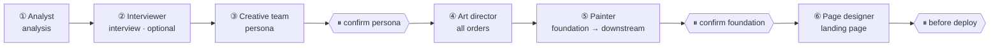

<div align="center">

<picture>
  <source media="(prefers-color-scheme: dark)" srcset="./assets/hero-dark.webp">
  
</picture>

# RepoChan · Character File No. REPO-001

**Turn any git repository into a living mascot persona and a consistent visual brand** —

character sheets, icons, stickers, posters, and a landing page — driven by *your* coding agent.

[](https://www.npmjs.com/package/repochan)
[](../../../LICENSE)
[](https://nodejs.org)
[](../../../packages/skill/)

**[English](./README.md) · [中文文档](./README_zh.md) · [Architecture](../../../ARCHITECTURE.md)**

</div>

---

You already use a coding agent (Claude Code, Codex, Pi, Cursor, Hermes, …). RepoChan gives that agent a creative pipeline to run: **analysis → persona → art direction → painting → landing page**. Hard rules live in code (schemas, state machine, dependency gates); creative judgment lives in skills. There is **no embedded runtime** — your agent orchestrates, RepoChan tracks.

This README is the **character-file** skin: everything on this page — the persona below included — is real pipeline output, dogfooded for RepoChan itself.

## Try it

**Prerequisites:** Node.js ≥ 20, a coding agent you already use, and (for image generation) an OpenAI-compatible images endpoint.

```bash
npm install -g repochan && repochan setup          # installs skills into your agent
# repochan image configure       # image endpoint credentials configuration
```

Then open your coding agent in the project and input `/repochan` to run the RepoChan workflow. Try:

> "Give this repo a mascot and full brand assets"  
> "yolo, full pipeline"  
> "Only analyze this repository"

Run `repochan setup` again after upgrading the CLI so the bundled skills are refreshed; `repochan status` reports version drift when a refresh is needed.

<details>
<summary><b>Build from source (contributors)</b></summary>

```bash
pnpm install
pnpm -r build                 # builds core, image-gen, image-edit, cli
pnpm --filter repochan exec node dist/index.js setup
pnpm test                     # full monorepo test suite
```

See [`ARCHITECTURE.md`](../../../ARCHITECTURE.md) for the package layout, dependency direction, and release contract.

</details>

---

## How a persona is born

You talk to **your agent**. The wizard skill schedules the teams:



| Mode | When | Behavior |
|------|------|----------|
| **Wizard (default)** | "Make me a mascot and site" | Full pipeline, stop at checkpoints |
| **yolo** | You explicitly say `yolo` | Default creative decisions inside the authorized scope; external writes still require explicit authorization |
| **Non-interactive** | CI / no TTY | Auto-select local reversible decisions; stop before unauthorized external writes |
| **Per-team (advanced)** | "Only run analysis" / "redraw this order" | Single team skill |

**Visual consistency** is anchored by a **foundation sheet** (character design cover). Downstream assets reference it, so the brand stays coherent from icon to landing page. Every role produces a schema-validated, versioned artifact under `.repochan/` — you can `cat`, `diff`, and `git blame` the whole creative state.

---

## Character file — RepoChan (仓库酱)

The persona below is not marketing copy. It is the actual content of [`.repochan/persona/current.json`](../../../.repochan/persona/current.json) (`repochan.persona.v2`), produced by the creative team and confirmed at checkpoint ① — the same artifact your repo would get.

| Field | Value |
|-------|-------|
| **Name** | RepoChan · 仓库酱 |
| **Age (appearance)** | 16 |
| **Occupation** | High-school freshman · freelance illustrator (pen name: 仓库酱) · runs Sugar Riff |
| **Studio** | Sugar Riff — a rented corner shop in the creative district; crooked fluorescent-pink sticker on the door |
| **Height** | ~158 cm |
| **Birthday** | 06-13 — sourced from the git first commit |
| **Catchphrase** | 「只要手里画笔在，到哪都是实力派。」 |
| **Motto** | "Drawing and rock are the same thing: smash what's inside you out." |
| **Fuel** | Iced cola (the studio fridge never runs out) · convenience-store sandwiches · rock riffs |
| **Special skill** | Names any song within its first three chords; sketches a character impression from a social profile in three minutes |
| **Palette** | `#38BDF8` `#F9A8D4` `#A78BFA` `#34D399` `#FACC15` `#111827` |
| **Visual anchors** | Silver hair with pink-mint tips · heterochromia (lake blue + purple pink) · cat-ear hair clip · star-cursor earring · oversized REPO hoodie · headphones |

## Exhibits — real pipeline output

Every exhibit is dogfooded: generated by RepoChan for RepoChan, archived under `.repochan/orders/`, and exported here with `repochan image edit compress`.

<table>
  <tr>
    <td align="center"><br/><sub>EXHIBIT A · foundation sheet — <code>ord-foundation-001</code></sub></td>
    <td align="center"><br/><sub>EXHIBIT B · poster — <code>ord-poster-001</code></sub></td>
  </tr>
</table>


<sub>EXHIBIT C · expressions &amp; web states — chroma-grid sheets cut by `repochan image edit` (soft-alpha unmix, centroid assignment, fail-loud QA)</sub>

<table>
  <tr>
    <td align="center"><br/><sub>EXHIBIT D · her own site — <code>character-game-page</code> starter</sub></td>
    <td align="center"><br/><sub>EXHIBIT E · app icon — <code>ord-icon-001</code></sub></td>
  </tr>
</table>

---

## Starters

Complete, localizable Astro sites — each with slots, locale files, and order-backed assets. `repochan starter pull` any of them:

<table>
  <tr>
    <td align="center"><a href="../../../packages/starters/character-game-page"><br/><sub>character-game-page</sub></a></td>
    <td align="center"><a href="../../../packages/starters/landing-museum"><br/><sub>museum</sub></a></td>
    <td align="center"><a href="../../../packages/starters/landing-glitch-os"><br/><sub>glitch-os</sub></a></td>
  </tr>
</table>

…plus 17 more — see the [starter catalog](../../../packages/starters/README.md).

---

## Go deeper

| Doc | Contents |
|-----|----------|
| [`ARCHITECTURE.md`](../../../ARCHITECTURE.md) | Layers, packages, binding model, design principles, known gaps |
| [`docs/releasing.md`](../../../docs/releasing.md) | Leaf-first release contract |
| [`packages/skill/`](../../../packages/skill/) | Skill inventory (wizard + team roles) |
| [`packages/core/`](../../../packages/core/) | Protocol, schemas, business rules |
| [`packages/starters/`](../../../packages/starters/) | Landing-page starter catalog |

---

## Acknowledgments

RepoChan's cutout / grid-extraction pipeline (`@repochan/image-edit`) borrows proven techniques from these open-source projects:

- [`aldegad/sprite-gen`](https://github.com/aldegad/sprite-gen) (Apache-2.0) — the chroma v2 pipeline is a TypeScript port of its known-key soft-alpha unmix, trapped-spill despill, and key-depth classification; the centroid grid geometry (component assignment, merged-span split, debris handling) follows its slice-sheet design. See [`packages/image-edit/NOTICE`](../../../packages/image-edit/NOTICE).
- [`0x0funky/agent-sprite-forge`](https://github.com/0x0funky/agent-sprite-forge) — generation-side stabilization ideas: layout-guide images as composition references and fail-loud QC gates that feed regeneration instead of masking defects.
