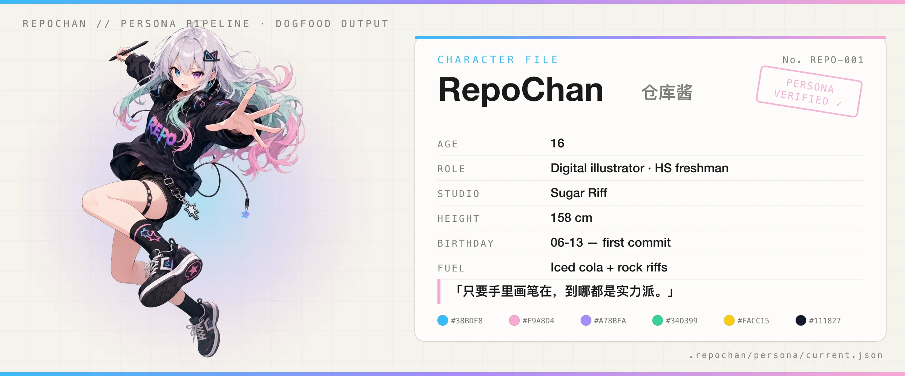
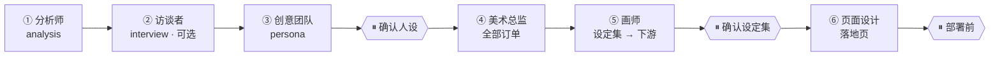
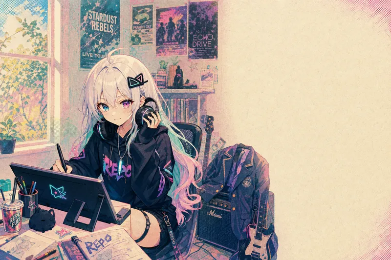
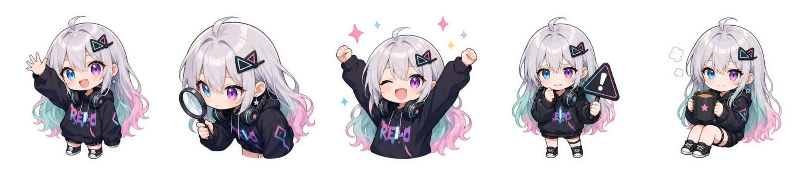
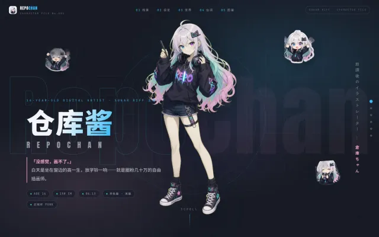
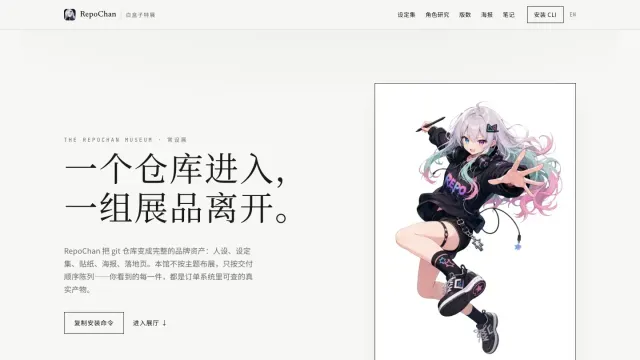

<div align="center">

<picture>
  <source media="(prefers-color-scheme: dark)" srcset="./assets/hero-dark.webp">
  
</picture>

# RepoChan · 角色档案 No. REPO-001

**把任何 git 仓库变成有生命力的吉祥物人设和统一的视觉品牌** ——

角色设定集、图标、贴纸、海报、落地页——由*你自己的* coding agent 驱动。

[](https://www.npmjs.com/package/repochan)
[](../../../LICENSE)
[](https://nodejs.org)
[](../../../packages/skill/)

**[English](./README.md) · [中文文档](./README_zh.md) · [架构](../../../ARCHITECTURE.md)**

</div>

---

你已经在用某个 coding agent（Claude Code、Codex、Pi、Cursor、Hermes……）。RepoChan 交给它一条创意产线：**分析 → 人设 → 美术指导 → 绘制 → 落地页**。硬规则在代码里（schema、状态机、依赖门禁），创意判断在 skill 里。**没有内嵌运行时**——你的 agent 负责编排，RepoChan 负责记账。

这份 README 是 **character-file** 皮肤：本页的一切——包括下面那份人设档案——都是产线的真实产物，是 RepoChan 给自己吃的狗粮。

## 试试看

**前置要求**：Node.js ≥ 20、一个你已在用的 coding agent、（生成图像需要）一个 OpenAI 兼容的 images endpoint。

```bash
npm install -g repochan && repochan setup          # 把 skill 装进你的 agent
# repochan image configure       # 配置图像端点凭证
```

然后在项目里打开你的 coding agent，输入 `/repochan` 运行 RepoChan 工作流。试试：

> 「给这个仓库一个吉祥物和全套品牌资产」  
> 「yolo，全流程」  
> 「只分析这个仓库」

升级 CLI 后再跑一次 `repochan setup` 刷新随包 skill；`repochan status` 会在需要刷新时提示版本漂移。

<details>
<summary><b>从源码构建（贡献者）</b></summary>

```bash
pnpm install
pnpm -r build                 # 构建 core、image-gen、image-edit、cli
pnpm --filter repochan exec node dist/index.js setup
pnpm test                     # 全量 monorepo 测试
```

包结构、依赖方向、发布合同见 [`ARCHITECTURE.md`](../../../ARCHITECTURE.md)。

</details>

---

## 人设是怎么诞生的

你跟**你的 agent**对话，向导 skill 负责调度团队：



| 模式 | 何时 | 行为 |
|------|------|------|
| **向导（默认）** | 「给我做吉祥物和网站」 | 全流程，检查点停下确认 |
| **yolo** | 你明确说 `yolo` | 授权范围内用默认创意决策；外部写仍需明确授权 |
| **非交互** | CI / 无 TTY | 自动选本地可逆决策；未授权的外部写之前停 |
| **单团队（高级）** | 「只做分析」「重画这张单」 | 单个团队 skill |

**视觉一致性**由**设定集（foundation sheet）**锚定：下游资产全部引用它，从 icon 到落地页保持同一角色。每个角色产出的是 `.repochan/` 下 schema 校验过的版本化产物——整个创意状态都能 `cat`、`diff`、`git blame`。

---

## 角色档案——仓库酱（RepoChan）

下面这份档案不是宣传文案。它是 [`.repochan/persona/current.json`](../../../.repochan/persona/current.json)（`repochan.persona.v2`）的真实内容，由创意团队产出、在检查点 ① 确认——你的仓库跑完产线也会得到同构的一份。

| 字段 | 值 |
|------|-----|
| **名字** | 仓库酱 · RepoChan |
| **年龄（外表）** | 16 |
| **职业** | 高中一年级学生 / 自由插画师（笔名：仓库酱）· Sugar Riff 主理人 |
| **工作室** | Sugar Riff——创意街区转角的小店面，门口贴着歪字荧光粉手写贴纸 |
| **身高** | 约 158cm |
| **生日** | 06-13——取自 git 首次提交 |
| **口头禅** | 「只要手里画笔在，到哪都是实力派。」 |
| **座右铭** | 「画画和摇滚是一回事：都是把心里的东西砸出来。」 |
| **燃料** | 冰可乐（工作室冰箱永远囤着）· 便利店三明治 · 摇滚 riff |
| **特技** | 任意歌曲前三个和弦内报出歌名；看社交主页三分钟画出角色印象速写 |
| **色板** | `#38BDF8` `#F9A8D4` `#A78BFA` `#34D399` `#FACC15` `#111827` |
| **视觉锚点** | 银发粉薄荷挑染 · 异色瞳（湖蓝 + 紫粉）· 猫耳发夹 · 星形光标耳坠 · oversized REPO 卫衣 · 大耳机 |

## 展品——产线真实产物

每件展品都是狗粮：由 RepoChan 为 RepoChan 生产，归档在 `.repochan/orders/` 下，用 `repochan image edit compress` 导出到此页。

<table>
  <tr>
    <td align="center"><br/><sub>展品 A · 设定集 — <code>ord-foundation-001</code></sub></td>
    <td align="center"><br/><sub>展品 B · 海报 — <code>ord-poster-001</code></sub></td>
  </tr>
</table>



<sub>展品 C · 表情与网页状态 — 由 `repochan image edit` 切分的 chroma-grid 网格图（soft-alpha unmix、质心归格、fail-loud QA）</sub>

<table>
  <tr>
    <td align="center"><br/><sub>展品 D · 她自己的网站 — <code>character-game-page</code> starter</sub></td>
    <td align="center"><br/><sub>展品 E · 应用图标 — <code>ord-icon-001</code></sub></td>
  </tr>
</table>

---

## Starter

完整可本地化的 Astro 站点——slot、locale 文件、订单溯源资产齐备。任意 `repochan starter pull`：

<table>
  <tr>
    <td align="center"><a href="../../../packages/starters/character-game-page"><br/><sub>character-game-page</sub></a></td>
    <td align="center"><a href="../../../packages/starters/landing-museum"><br/><sub>museum</sub></a></td>
    <td align="center"><a href="../../../packages/starters/landing-glitch-os"><br/><sub>glitch-os</sub></a></td>
  </tr>
</table>

……另有 17 个，见 [starter 目录](../../../packages/starters/README.md)。

---

## 深入了解

| 文档 | 内容 |
|------|------|
| [`ARCHITECTURE.md`](../../../ARCHITECTURE.md) | 分层、包、绑定模型、设计原则、已知缺口 |
| [`docs/releasing.md`](../../../docs/releasing.md) | 叶子优先的发布合同 |
| [`packages/skill/`](../../../packages/skill/) | skill 清单（向导 + 团队角色） |
| [`packages/core/`](../../../packages/core/) | 协议、schema、业务规则 |
| [`packages/starters/`](../../../packages/starters/) | 落地页 starter 目录 |

---

## 致谢

RepoChan 的抠图 / 网格切分管线（`@repochan/image-edit`）借鉴了以下开源项目的成熟技术：

- [`aldegad/sprite-gen`](https://github.com/aldegad/sprite-gen)（Apache-2.0）—— chroma v2 管线移植自其已知背景色 soft-alpha unmix、trapped-spill despill 与 key-depth 分类；centroid 网格几何（连通域归格、跨格劈分、碎屑处理）沿袭其 slice-sheet 设计。见 [`packages/image-edit/NOTICE`](../../../packages/image-edit/NOTICE)。
- [`0x0funky/agent-sprite-forge`](https://github.com/0x0funky/agent-sprite-forge) —— 生成侧稳定化思路：以 layout-guide 图作为构图参考、fail-loud 质检门驱动重生而非掩盖缺陷。
