<div align="center">

<picture>
  <source media="(prefers-color-scheme: dark)" srcset="./assets/hero-comic-dark.webp">
  
</picture>

# RepoChan

**把任何 git 仓库变成有生命力的吉祥物人设和统一的视觉品牌** ——

角色设定集、图标、贴纸、海报、落地页——由*你自己的* coding agent 驱动。

<br/>

[](https://www.npmjs.com/package/repochan)
[](../../../LICENSE)
[](https://nodejs.org)
[](../../../packages/skill/)

**[English](./README.md) · [中文文档](./README_zh.md) · [架构](../../../ARCHITECTURE.md)**

</div>

---

你已经在用某个 coding agent（Claude Code、Codex、Pi、Cursor、Hermes……）。RepoChan 交给它一条创意产线：**分析 → 人设 → 美术指导 → 绘制 → 落地页**。硬规则在代码里（schema、状态机、依赖门禁），创意判断在 skill 里。**没有内嵌运行时**——你的 agent 负责编排，RepoChan 负责记账。

这个皮肤把这条产线画成了它在仓库内部看起来的样子：一条五格漫画。

## 五格，逐格讲

漫画里的每一格都是产线上的一个真实团队。**⏸ 角标**是检查点——故事到那里会停下来，等你拍板才翻下一格。（格内 caption 为英文装饰，信息以下表为准。）

<table>
  <tr>
    <td align="center" width="140">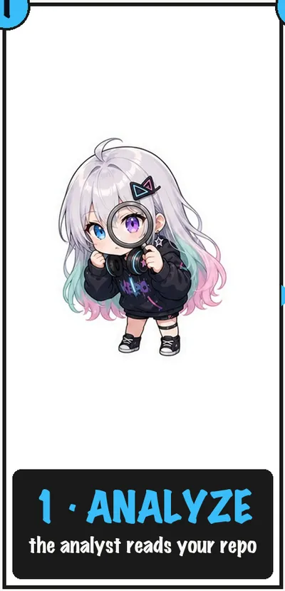</td>
    <td>
      <b>1 · 分析 ANALYZE</b><br/>
      分析师读你的仓库：先做确定性扫描（技术栈、结构、历史），再做 LLM 预分析和抽象维度画像。<br/>
      <sub>产物：<code>.repochan/</code> 下的分析报告</sub>
    </td>
  </tr>
  <tr>
    <td align="center">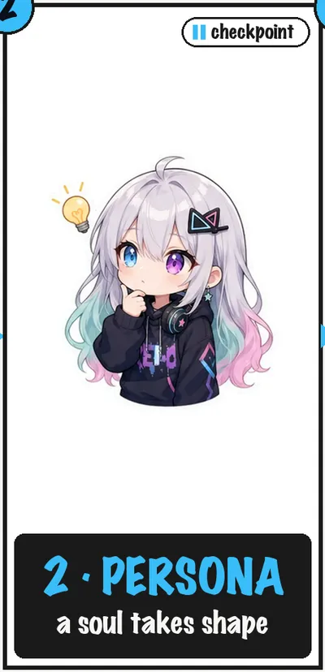</td>
    <td>
      <b>2 · 人设 PERSONA ⏸</b><br/>
      三智能体创意团队——世界架构师、角色设计师、一致性守护者——基于分析报告和可选访谈，设计出有生命力的吉祥物人设。<br/>
      <sub>产物：人设文档 · <b>检查点：你确认人设</b></sub>
    </td>
  </tr>
  <tr>
    <td align="center">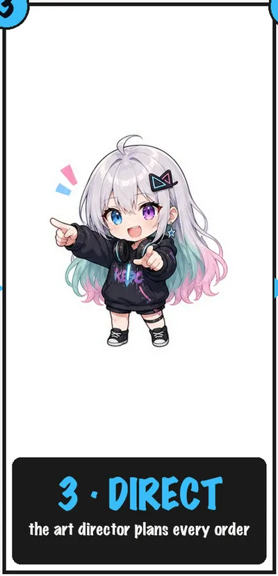</td>
    <td>
      <b>3 · 美术 DIRECT</b><br/>
      美术总监一次性创建全部创作任务——设定集 + 所有下游资产订单——角色一致性是规划出来的，不是碰运气。<br/>
      <sub>产物：<code>.repochan/orders/</code> 下的资产订单</sub>
    </td>
  </tr>
  <tr>
    <td align="center">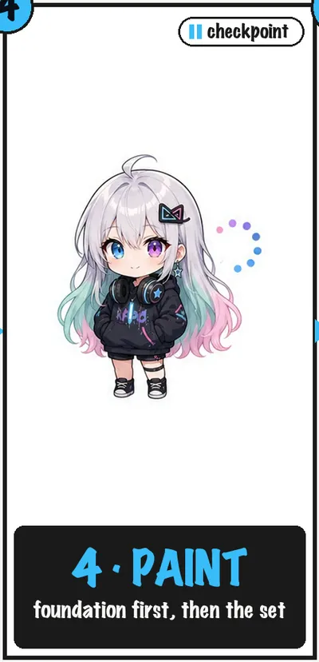</td>
    <td>
      <b>4 · 画师 PAINT ⏸</b><br/>
      画师执行订单，设定集优先；下游资产全部引用它，从 icon 到落地页保持同一角色。<br/>
      <sub>产物：版本化的订单结果 · <b>检查点：你确认设定集</b></sub>
    </td>
  </tr>
  <tr>
    <td align="center">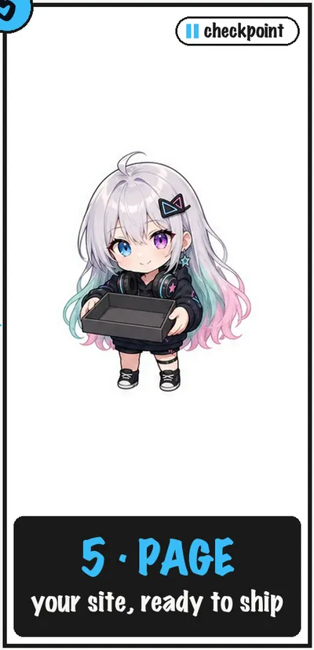</td>
    <td>
      <b>5 · 页面 PAGE ⏸</b><br/>
      页面设计师装配并本地化一个完整落地站，接上画师刚画好的订单资产。<br/>
      <sub>产物：项目网站 · <b>检查点：部署必须你明确同意</b></sub>
    </td>
  </tr>
</table>

故事允许怎么讲：

| 模式 | 何时 | 行为 |
|------|------|------|
| **向导（默认）** | 「给我做吉祥物和网站」 | 全流程，检查点停下确认 |
| **yolo** | 你明确说 `yolo` | 授权范围内用默认创意决策；外部写仍需明确授权 |
| **非交互** | CI / 无 TTY | 自动选本地可逆决策；未授权的外部写之前停 |
| **单团队（高级）** | 「只做分析」「重画这张单」 | 单个团队 skill |

**视觉一致性**由**设定集（foundation sheet）**锚定。每个角色产出的是 `.repochan/` 下 schema 校验过的版本化产物——整个创意状态都能 `cat`、`diff`、`git blame`。

---

## 试试看

**前置要求**：Node.js ≥ 20、一个你已在用的 coding agent、（生成图像需要）一个 OpenAI 兼容的 images endpoint。

```bash
npm install -g repochan && repochan setup          # 把 skill 装进你的 agent
# repochan image configure       # 配置图像端点凭证
```

然后在项目里打开你的 coding agent，输入 `/repochan` 运行 RepoChan 工作流。试试：

> 「给这个仓库一个吉祥物和全套品牌资产」  
> 「yolo，全流程」  
> 「只分析这个仓库」

升级 CLI 后再跑一次 `repochan setup` 刷新随包 skill；`repochan status` 会在需要刷新时提示版本漂移。

<details>
<summary><b>从源码构建（贡献者）</b></summary>

```bash
pnpm install
pnpm -r build                 # 构建 core、image-gen、image-edit、cli
pnpm --filter repochan exec node dist/index.js setup
pnpm test                     # 全量 monorepo 测试
```

包结构、依赖方向、发布合同见 [`ARCHITECTURE.md`](../../../ARCHITECTURE.md)。

</details>

---

## 幕后道具

下面的一切都是这条产线为 RepoChan 自己生产的——就是你在漫画里见到的那位仓库酱。

<table>
  <tr>
    <td align="center" width="50%">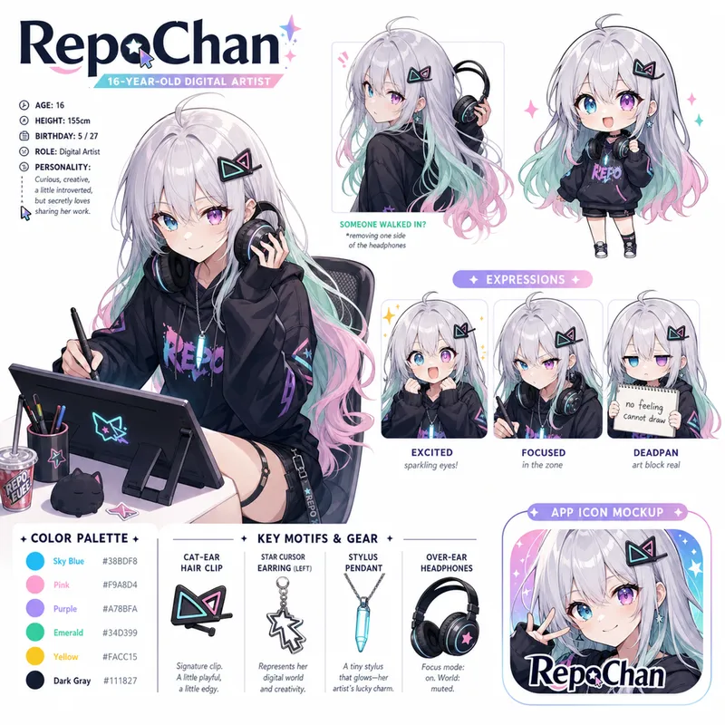<br/><sub><b>设定集</b> · <code>ord-foundation-001</code></sub></td>
    <td align="center" width="50%">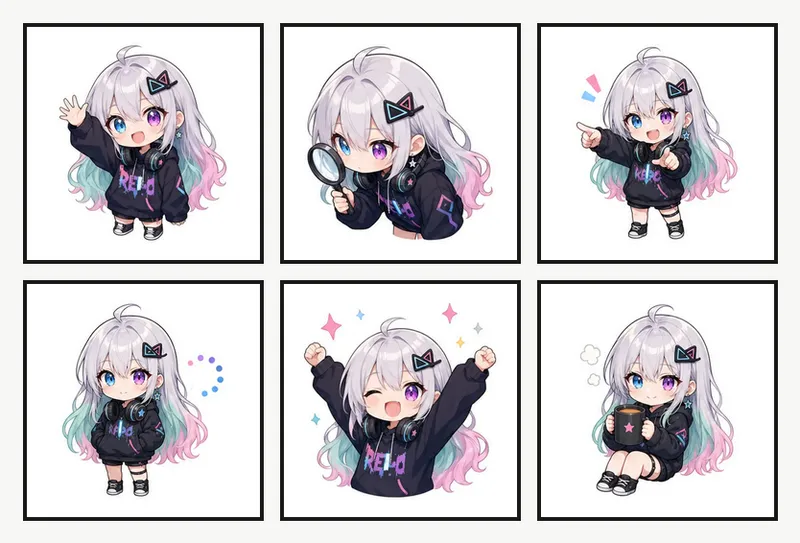<br/><sub><b>贴纸 &amp; webstates</b> · <code>ord-sticker-001</code> / <code>ord-webstates-001</code></sub></td>
  </tr>
  <tr>
    <td align="center">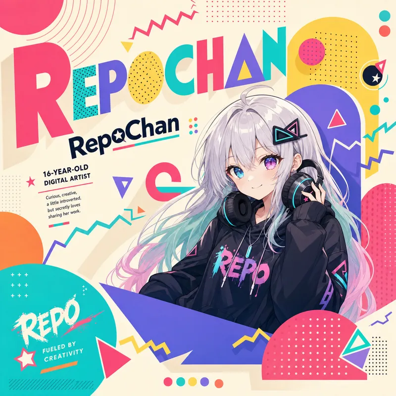<br/><sub><b>海报</b> · <code>ord-poster-memphis-001</code></sub></td>
    <td align="center">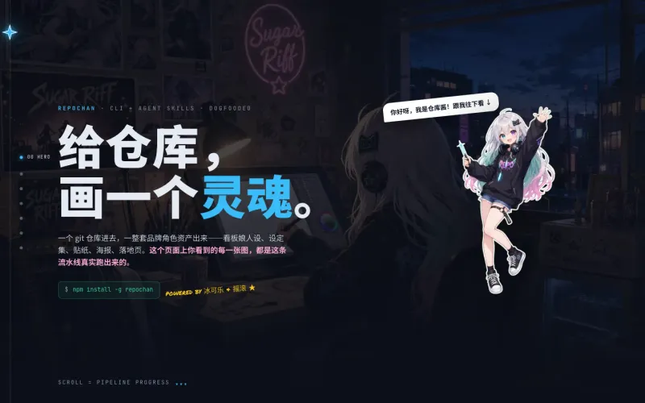<br/><sub><b>落地 starter</b> · <code>landing-scrollytelling</code></sub></td>
  </tr>
</table>

网格图在统一 matte 上以 layout-guide 为构图参考生成，再由我们自己的 chroma-grid 管线切分（soft-alpha unmix、质心归格、fail-loud QA）——同样的 `repochan image edit` 命令就随 CLI 发布。上面五格主视觉正是用这些 tile 由 [`assets/build_comic.py`](./assets/build_comic.py) 确定性拼出的——没有动用一次额外的图像生成。

## 下一话预告

完整可本地化的 Astro 站点——slot、locale 文件、订单溯源资产齐备。任意 `repochan starter pull`：

<table>
  <tr>
    <td align="center"><a href="../../../packages/starters/landing-glitch-os">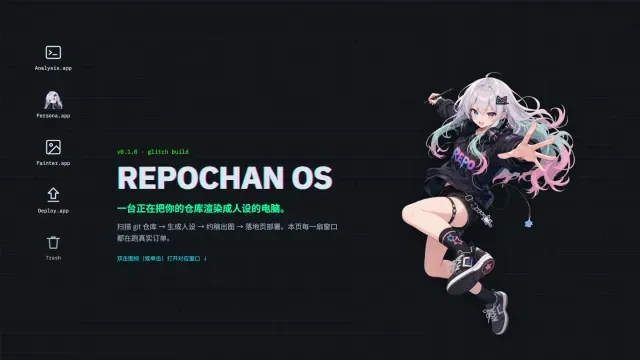<br/><sub>glitch-os</sub></a></td>
    <td align="center"><a href="../../../packages/starters/landing-solarpunk">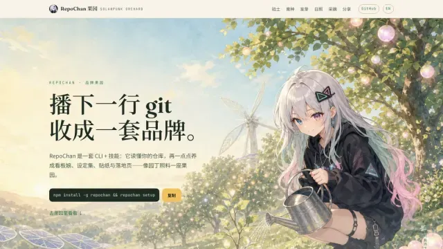<br/><sub>solarpunk</sub></a></td>
    <td align="center"><a href="../../../packages/starters/landing-museum"><br/><sub>museum</sub></a></td>
  </tr>
</table>

……另有 17 个，见 [starter 目录](../../../packages/starters/README.md)。

---

## 深入了解

| 文档 | 内容 |
|------|------|
| [`ARCHITECTURE.md`](../../../ARCHITECTURE.md) | 分层、包、绑定模型、设计原则、已知缺口 |
| [`docs/releasing.md`](../../../docs/releasing.md) | 叶子优先的发布合同 |
| [`packages/skill/`](../../../packages/skill/) | skill 清单（向导 + 团队角色） |
| [`packages/core/`](../../../packages/core/) | 协议、schema、业务规则 |
| [`packages/starters/`](../../../packages/starters/) | 落地页 starter 目录 |

---

## 致谢

RepoChan 的抠图 / 网格切分管线（`@repochan/image-edit`）借鉴了以下开源项目的成熟技术：

- [`aldegad/sprite-gen`](https://github.com/aldegad/sprite-gen)（Apache-2.0）—— chroma v2 管线移植自其已知背景色 soft-alpha unmix、trapped-spill despill 与 key-depth 分类；centroid 网格几何（连通域归格、跨格劈分、碎屑处理）沿袭其 slice-sheet 设计。见 [`packages/image-edit/NOTICE`](../../../packages/image-edit/NOTICE)。
- [`0x0funky/agent-sprite-forge`](https://github.com/0x0funky/agent-sprite-forge) —— 生成侧稳定化思路：以 layout-guide 图作为构图参考、fail-loud 质检门驱动重生而非掩盖缺陷。
